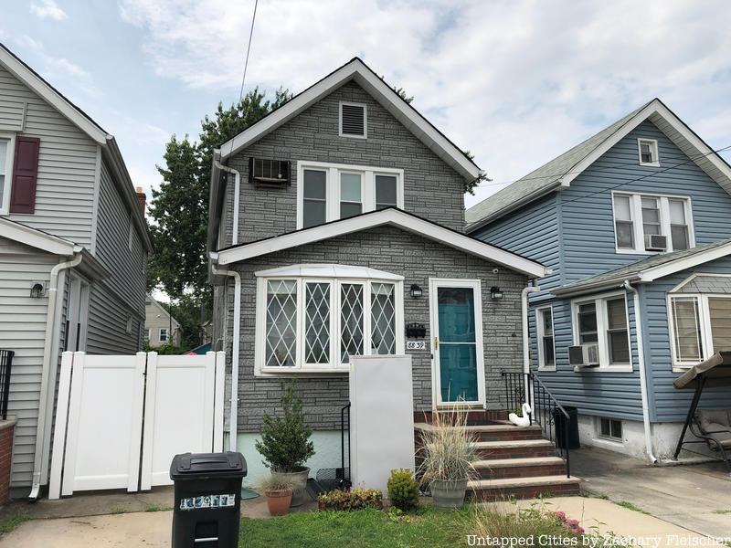
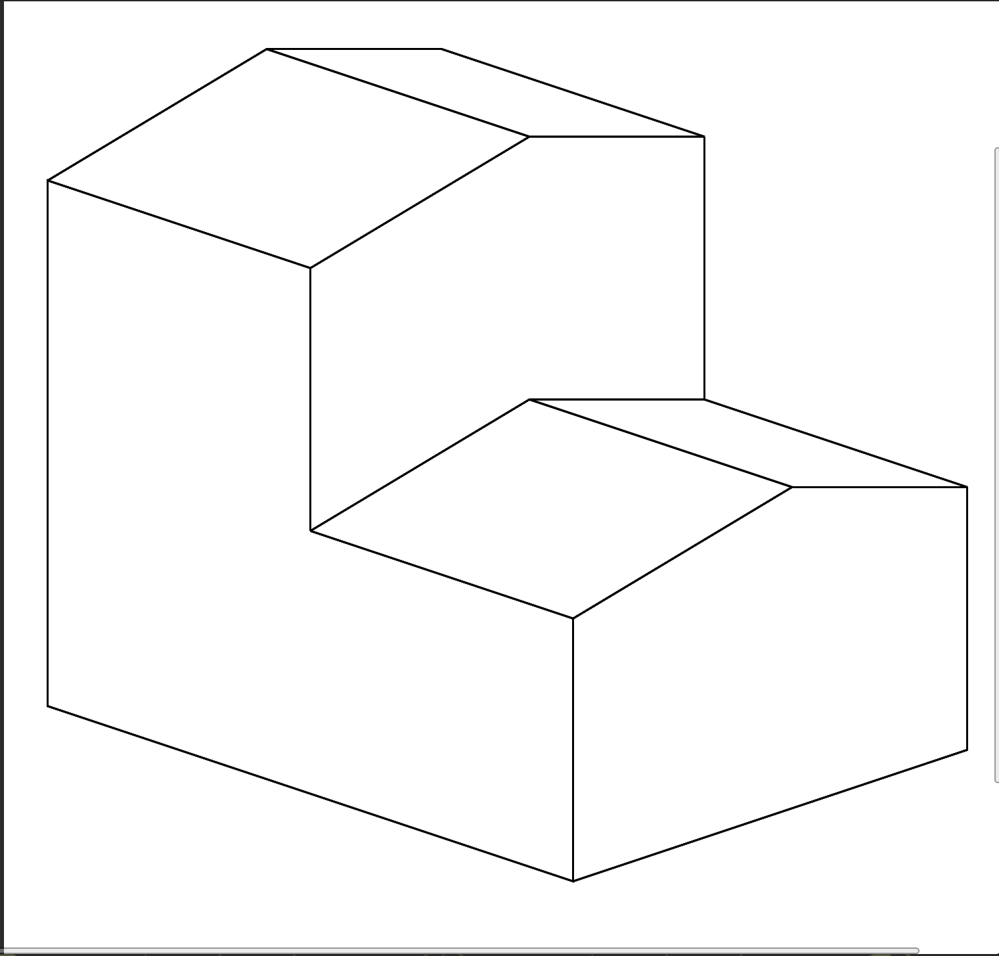
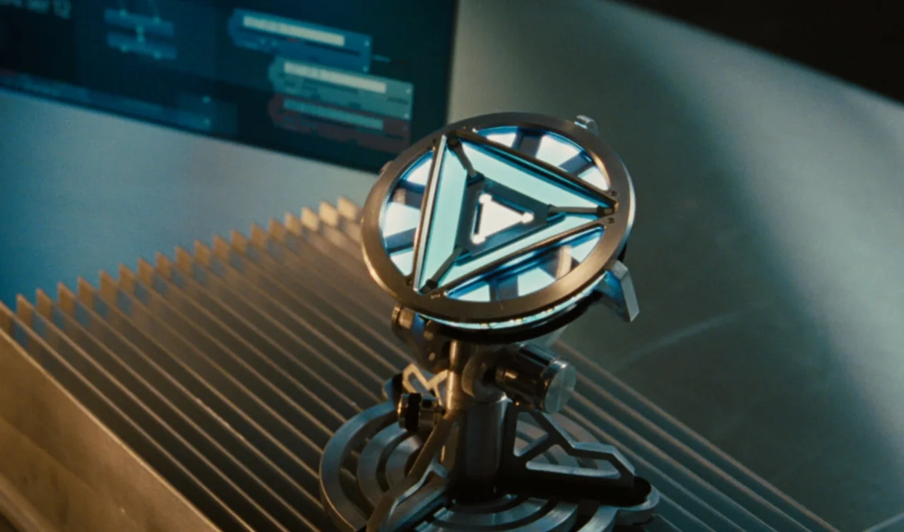
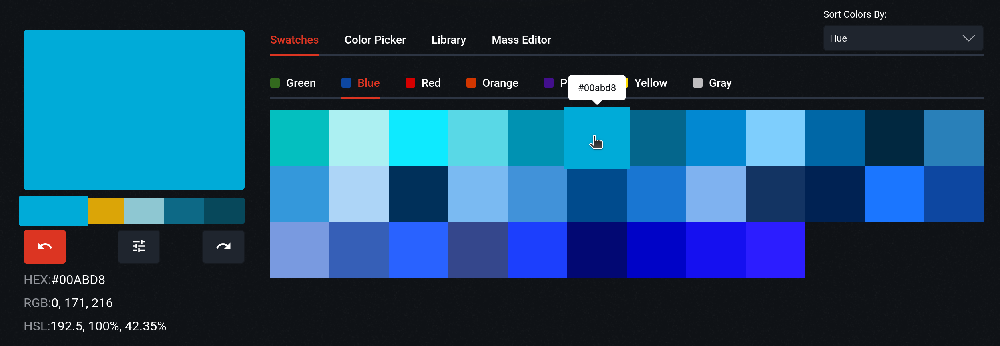
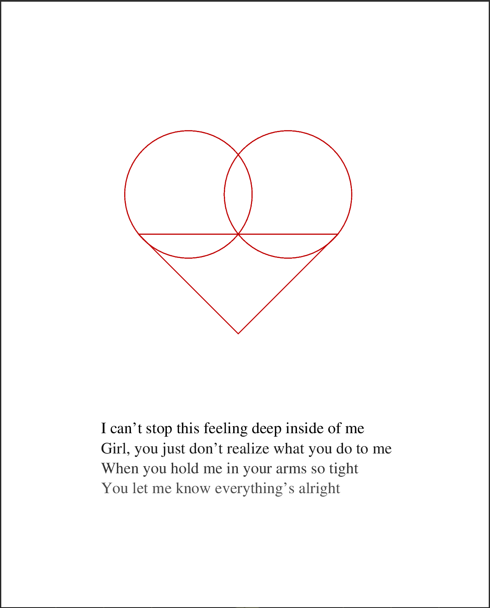
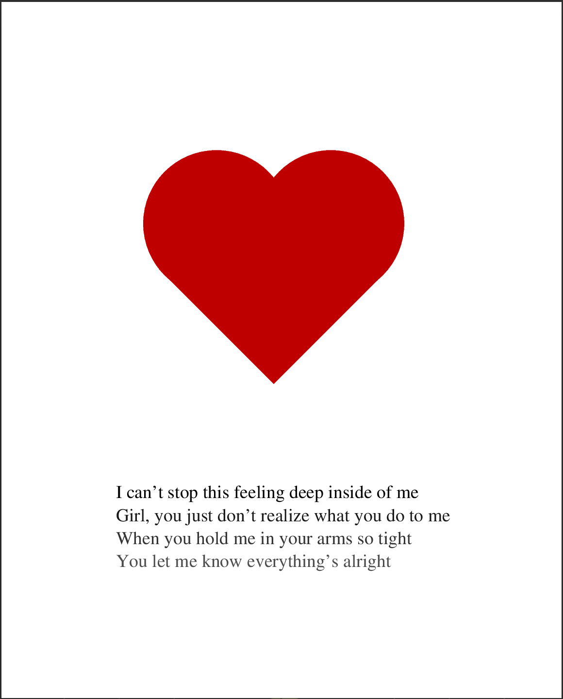
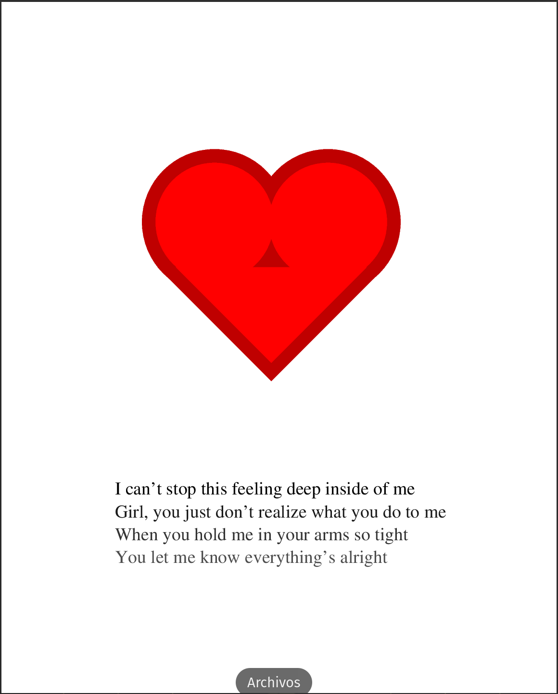
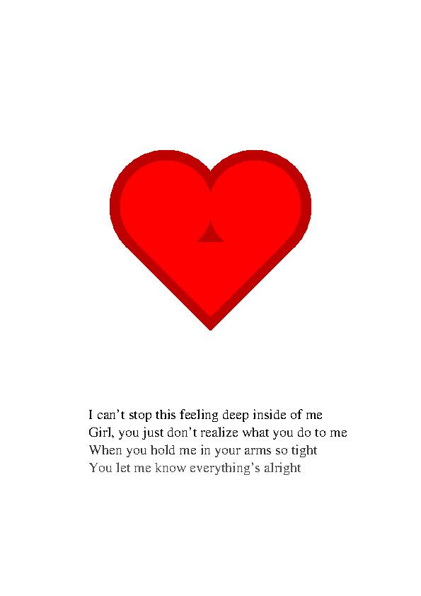

#   Práctica 4

##  El lenguaje Postscript

###  Mauricio Luque Jiménez

#### Índice

- [Ejercicios obligatorios](#obg)
    - [Página que muestre el dibujo de una casa](#casa)
    - [Página que muestre una tarjeta de visita](#tarjeta)

- [Ejercicio opcional](#opc)
    - [Página que muestre el dibujo de un corazón y un texto en varios tonos de gris](#<3)

- [Conversión a formatos JPG y PDF](#conversion)

En esta práctica se van a mostrar algunas páginas simples desarrolladas con el lenguaje de programación PostScript, además de mostrar el uso de un visualizador del formato _.ps_ como GhostScript.

##  Ejercicios obligatorios
###  Página que muestre el dibujo de una casa

Para este ejercicio, en lugar de hacer una casa simple en dos dimensiones, se va a utilizar la exactitud numérica que ofrece PostScript para mostrar una casa tres dimensiones, concretamente en perspectiva caballera. Para ello, se va a utilizar como referencia una casa típica del barrio de Queens, Nueva York: una casa unifamiliar con un pequeño saliente en la entrada, con ambas partes teniendo un tejado en forma triangular. Para tenerlo en mente, la referencia sería algo así:

Y he aquí una serie de bocetos para perfeccionar el diseño inicial:

Por lo tanto, va a haber que dibujar:
- Los laterales trasero y delantero, que siempre van a estar visibles.
- La fachada trasera (si se dibuja únicamente la parte superior siempre van a estar visibles) y delantera (esta parte siempre va a estar a la vista, independiemente de los añadidos posteriores).
- Los tejados traseros y delanteros (que al principio van a servir para marcar la perspectiva en los bordes más alejados del (0,0) pero que finalmente van a acabar por debajo de los tejados en forma de triángulo).

Como hemos visto, en ningún momento se mencionan las bases como parte esencial del dibujo, puesto que a la larga no es trascendental. Si se empezara por las bases, al añadir paredes y tejados, habría que borrarlos posteriormente. Eso sí, sí se pueden hacer en un principio a modo de boceto para precisar la perspectiva. Perspectiva, por cierto, que en lo referido a la estructura de la casa (sin hablar del tejado), siempre va a ser en una proporción 3:1. De esta manera, movimiento en el eje Y supondrá un movimiento el triple de grande en el eje X. Así pues, la mayoría de líneas que servirán para trazar los bordes horizontales de la casa vendrán definidos por:

        +- 150 +-50 rlineto

Además de las líneas pertenecientes a las bases, hay más líneas auxiliares que pueden servir como soporte durante el dibujo que no aparecen finalmente. Éstas son:

- Las líneas (paralelas) que separan horizontalmente la parte delantera y trasera de la casa: tres líneas paralelas que se mueven tanto en el eje X como en el eje Y.
- Las líneas que marcan los cuadrados (invisibles), tales como parte posterior del edificio trasero y el lateral más alejado de ambos edificios.

Una vez hemos delimitado qué líneas son esenciales para el dibujo, el trazado es sencillo y fácilmente replicable. El siguiente paso es el dibujo de los tejados, cuyo patrón es el mismo tanto en el edificio delantero como en el trasero, y que, al estar en perspectiva caballera, tienen dos partes (partiendo del extremo más cercano al eje de coordenadas):
- Una línea creciente tanto en el eje X como en el eje Y hasta llegar al punto más alto del triángulo.
- Una línea que solamente crece en el eje X hasta llegar al otro extremo del tejado.

Cabe mencionar que algunas líneas o trazados no se completan para no pisarse con otras zonas ya delineadas, lo que no aporta nada a la página salvo un exceso de tamaño de archivo. De esta manera, no se ha hecho uso de la función _closepath_, para evitar incongruencias con ciertos trazados que no eran importantes. Del mismo modo, es interesantes recalcar que para cada conjunto lógico de elementos se ha utilizado una única llamada a _newpath_: tantos la fachada delantera como la trasera están en el mismo _path_ (separados por distintos _moveto_), lo mismo que ocurre con los laterales, los techos y los tejados. He aquí un ejemplo, en el caso de los tejados:

    %Tejados
    %Tejado trasero
    newpath
    175 525 moveto
    125 75 rlineto
    100 0 rlineto

    25 575 moveto
    125 75 rlineto
    100 0 rlineto

    150 650 moveto
    150 -50 rlineto
    stroke

    %Tejado delantero
    newpath
    325 325 moveto
    125 75 rlineto
    100 0 rlineto

    175 375 moveto
    125 75 rlineto
    100 0 rlineto

    300 450 moveto
    150 -50 rlineto
    stroke

Así pues, la primera versión de la casa con los tejados queda así:

Si eliminamos los bordes superiores de las dos fachadas, el resultado es más limpio:

Finalmente, se pueden añadir los detalles que se quieran. En este caso, se va a añadir una puerta en la fachada delantera y una serie de ventanas en cada edificio.

[Pulse aquí para volver al inicio del primer ejercicio obligatorio](#casa)  
[Pulse aquí para volver al inicio de los ejercicios obligatorios](#obg)  
[Pulse aquí para volver al inicio de la práctica](#inicio)

###  Página que muestre una tarjeta de visita

El primer paso para el dibujo de la tarjeta de visita es apaisar la página, cosa que conseguimos con la línea:

    << /PageSize [842 595] >> setpagedevice

Cabe recalcar que, hasta ahora, las comprobaciones de los dibujos se estaban realizando mediante el Visor de Documentos estándar de !Pop_OS (distribución de Linux). Sin embargo, este ejercicio, al incluir un cambio en las dimensiones de la página, exige instalar un visor especializado en PostScript. En este caso, se ha optado por instalar GhostScript.

Después de esto y de elegir _Times New Roman_ como fuente de toda la página, vamos a crear un recuadro que ocupe un poco menos que toda la página disponible, y lo vamos a rellenar con un gris claro que lo diferencie del fondo.

En segundo lugar, vamos a insertar distintas líneas de texto. En este caso, vamos a aplicar un ligero desplazamiento a la derecha con cada línea que añadamos, lo cual lo vamos a conseguir sumando 15 unidades en el eje X (la primera línea va a estar en el punto 175 para intentar central todas las líneas). Además, vamos a aplicar una escala de grises con la función _setgray_, de manera que la primera línea va a empezar en 0 (completamente negro) y cada línea inferior va a sumar 0.10 hasta llegar a 0.40.

Por último, se va a acompañar el texto con un logo. En este caso, debido a su simplicidad geométrica, se va a tomar como referencia el reactor ARK triangular que porta el superhéroe Iron Man en su película homónima de 2010. Éste sería un punto de referencia:

Como vemos, la imagen sería un triángulo sencillo, que en este caso vamos a adornar con dos círculos: uno amarillo de menor diámetro dentro de un rojo más grande. Además, ambos círculos se van a rodear con otra circunferencia de color negro, que a diferencia de los círculos rojo y amarillo, no se van a rellenar mediante la función _fill_. En cuanto al color de los círculos, si bien van a respetar los colores característicos de Iron Man, no van a ser un rojo y amarillo al uso, sino que van a ser ligeras modificaciones más apagadas utilizando el sistema RGB. Así pues, así se se codificarían ambos colores:

- Rojo:

        0.85 0 0 setrgbcolor

- Amarillo:

        0.85 0.85 0 setrgbcolor

Evidentemente, los bordes se van a configurar con _0 0 0_, mientas que el triángulo interior va a ser un azul claro, al igual que en la película:

Para ello, vamos a tomar el siguiente código RGB, con ayuda de la web [Cooler Designer](https://colordesigner.io/color-scheme-builder) (concretamente se coge el valor #00abd8 como referencia):

Finalmente, el diseño final de la tarjeta es el siguiente:

[Pulse aquí para volver al inicio del segundo ejercicio obligatorio](#tarjeta)  
[Pulse aquí para volver al inicio de los ejercicios obligatorios](#obg)  
[Pulse aquí para volver al inicio de la práctica](#inicio)

##  Ejercicios opcionales
###  Página que muestre el dibujo de un corazón y un texto en varios tonos de gris

Para este ejercicio, vamos a utilizar varios elementos aprendidos en ejercicios anteriores. Primero, vamos a generar una escala de grises que se van a aplicar en distintas líneas de texto (en este caso, las dos primeras estrofas de la canción _Hooked on a Feeling_, de Björn Skifs y Blue Swede). Además, vamos a dibujar un corazón haciendo uso de triángulos/cuadrados y círculos, tal y como se ha hecho en los anteriores ejercicios.

El primer paso, una vez escrito el texto, es dibujar el cuadrado que va a hacer de parte inferior del corazón.

En segundo lugar, dibujamos las circunferencias que van a simular las partes superiores del corazón.

Después, rellenamos todas las figuras de color rojo.

Con esto podríamos dar por finalizado el ejercicio. Sin embargo, por darle un toque extra, vamos a añadir una capa superior dentro del corazón ya dibujado. Para esto, hemos rellenado el "fondo" con un rojo más apagado (dándole un valor menor a éste en la escala RGB). De esta manera, repetimos el proceso haciendo las figuras ligeramente más pequeñas (además, en este caso se dibuja un triángulo para la parte inferior y que no sobresalga por arriba).

Finalmente, después de seguir el mismo proceso que en el denominado fondo, terminamos el corazón interior.

Como se puede apreciar, el corazón interior no está del todo "relleno". Sin embargo, dado que se puede apreciar el borde exterior del primer corazón (que evidentemente permanece visible) y por cuestiones geométricas coincide con el eje inferior del triángulo (haciendo una especie de bisectriz, por llamarlo de alguna manera), el resultado es igualmente estético, e incluso podría considerarse un toque estético.

[Pulse aquí para volver al inicio del ejercicio opcional](#<3)  
[Pulse aquí para volver al inicio de los ejercicios obligatorios](#obg)  
[Pulse aquí para volver al inicio de la práctica](#inicio)

##  Conversión a formatos JPG y PDF

El último paso de esta práctica es convertir los archivos de formato PostScript a formatos más comunes y frecuentes, como en este caso van a ser JPG y PDF.

En primer lugar, para convertir los archivos a formato JPG, vamos a hacer uso de la herramienta GhostScript, que ya hemos utilizado anteriormente para visualizar el segundo ejercicio, que se mostraba apaisado. En este caso, tenemos que introducir el siguiente comando:

    gs -sDEVICE=jpeg -sOutputFile=file.jpg - < file.ps

Siendo _file.jpg_ el archivo a generar, y _file.ps_ el archivo en PostScript ya existente. De esta manera, el resultado es el siguiente:

A continuación, los ficheros JPG generados, almacenados en el directorio _/jpg_

Por otra parte, para convertir los ficheros a PDF basta con hacer uso del comando _ps2pdf_, que en el caso de !Pop_OS viene instalado por defecto. Así pues, el proceso de conversión es tal cual se muestra en la siguiente imagen:

Finalmente, los archivos PDF se almacenan en el directorio _/pdf_.