#   Práctica 1

##  Entrada/Salida utilizando interrupciones con lenguaje C

###  Mauricio Luque Jiménez

####  Índice

- [Funciones obligatorias](#obg)
    - [gotoxy()](#gotoxy)
    - [setcursortype()](#cursor)
    - [setvideomode()](#setvideo)
    - [getvideomode()](#getvideo)
    - [textcolor()](#textfondo) y [backgroundcolor()](#textfondo)
    - [clrscr()](#clrscr)
    - [cputchar()](#cputchar)
    - [getche()](#getche)

- [Funciones opcionales](#opc)
    - [recuadro()](#recuadro)
    - [CGA()](#CGA)
    - [ascii()](#ascii)

Para explicar la implementación de estas funciones, primero se explicará el código interno (incluido en esta práctica) y después se mostrará cómo se ejecutan en DOSBOX. Esto incluye la función principal del programa y algunas capturas de pantalla que muestren los resultados de dichas funciones. Para la ejecución de cada programa, previamente aparecerá en pantalla un menú sencillo realizado a través de un switch-case que permita elegir la función de esa ejecución en concreto. Cabe destacar que, aunque hay funciones para leer entradas de teclado e imprimir por pantalla, en la mayoría de ejercicios que no sea necesario su uso se utilizarán las funciones de C _scanf()_ y _printf()_, puesto que el objetivo de ese ejercicio concreto es otro. Adicionalmente, se ha utilizado una función _pausa()_ para los casos en los que se utilice la función diseñada para leer entradas de teclado.

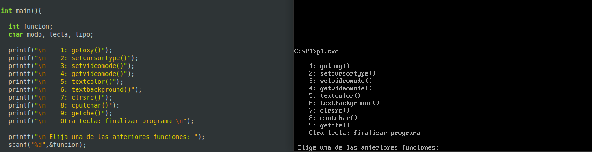

###  Funciones obligatorias

-  **gotoxy(): colocar el cursor en una posición determinada**

	Para este ejercicio, la función va a constar de dos argumentos: la coordenada _x_ y la coordenada _y_.
	Estas coordenadas se enviarán a los registros DH y DL, respectivamente.  Además, anteriormente vamos a indicar que la función a la que se llama es la función 2 mediante el registro AH, mientras que BH lo dejamos a 0. Finalmente, llamamos a la función int86() con el número de interrupción 0x10.

	A la hora de ejecutar esta función, lo único que hay que hacer es indicar las coordenadas _x_ e _y_. A modo de ejemplo, se han propuesto las coordenadas (40, 15).

    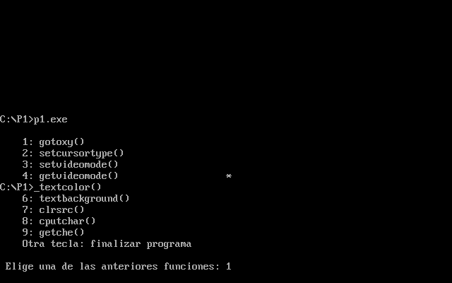

    [Pulse aquí para volver al inicio de las funciones obligatorias](#obg)  
    [Pulse aquí para volver al inicio de la página](#inicio)
	
-  **setcursortype(): fijar el aspecto del cursor**
	
	Para este ejercicio, la función va a constar de un único argumento: el tipo de cursor que queremos fijar. Con el fin de evitar problemas a la hora de leer el tipo de cursor, ese argumetno será de tipo carácter. Para el cursor invisible fijamos el valor 0, para el cursor normal el 1 y para el cursor grueso el 2. Indicamos la función 1 en el registro AH y hacemos un _switch-case_ en función del argumento _tipo_, en el que variarán los registros CH y CL. Finalmente, llamamos a la función int86() con el número de interrupción 0x10.

	A la hora de ejecutar esta función, primero se le pide al usuario que elija el tipo de cursor que desea fijar, y a continuación, después de cambiarlo, se muestra a espera de que el usuario finalice el programa.

    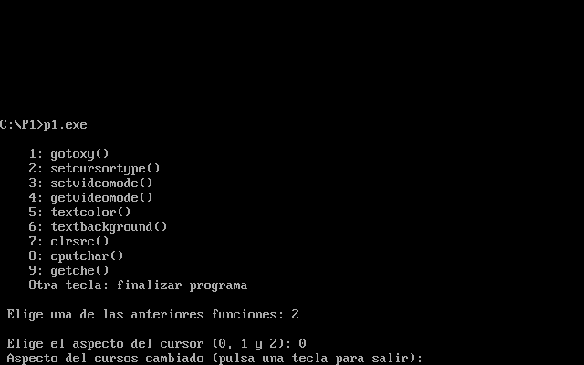
    
    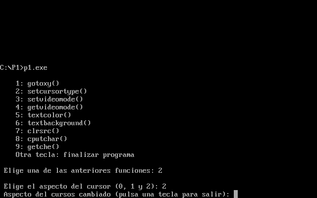

    [Pulse aquí para volver al inicio de las funciones obligatorias](#obg)  
    [Pulse aquí para volver al inicio de la página](#inicio)

	
-  **setvideomode(): fijar el modo de vídeo**

	Para este ejercicio. la función va a constar de un único argumento: el modo de vídeo que queremos fijar. Este argumento, de tipo carácter, irá al registro AL, mientras que el registro AH marcará que se usa la función 0. Así pues, el modo de vídeo quedará fijado hasta que se vuelva a cambiar posteriormente llamando de nuevo a la función.

	A la hora de ejecutar esta función, una vez se ha leído el modo de vídeo a fijar, se introduce el valor leído y se muestra el cambio de modo de vídeo.

    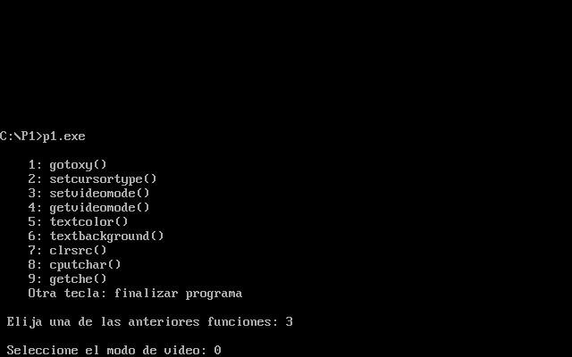
    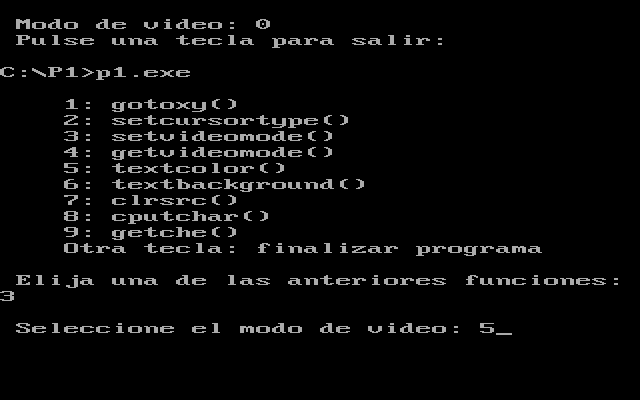
    
    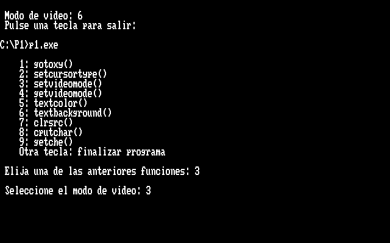

    [Pulse aquí para volver al inicio de las funciones obligatorias](#obg)  
    [Pulse aquí para volver al inicio de la página](#inicio)

-  **getvideomode(): obtener el modo de vídeo**

	Para este ejercicio, la función no consta de ningún argumento, sino que devuelve el modo de vídeo actual. De esta manera, lo único que hay que hacer es indicar el número de función, que es el 15, y devolver el registro AL como salida de la función.

	A la hora de ejecutar esta función, repetimos el último paso del ejercicio anterior: se muestra el valor de modo de vídeo actual.

    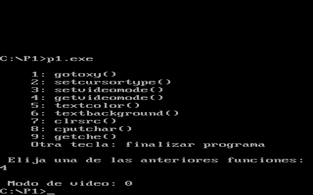

    [Pulse aquí para volver al inicio de las funciones obligatorias](#obg)  
    [Pulse aquí para volver al inicio de la página](#inicio)

-  **textcolor() y textbackground(): modificar el color de primer plano y el fondo**
	
	Estas funciones son bastante simples puesto que la complejidad de su funcionamiento reside en la función _cputchar()_. Por consecuente, estas funciones se limitan a modificar (mediante los argumentos de sendas funciones) las variables globales de _texto_ y _fondo_ con las que se fijan los colores del texto y el fondo.

	A la hora de ejecutar esta función, una vez se ha leído el valor del color o el fondo y se han modificado las variables globales, se hace uso de la función _cputchar()_ ya que la función _printf()_ omitiría estos valores y no permitiría ver los colores fijados. En este caso, imprimimos un asterisco a modo de ejemplo sencillo.

    
    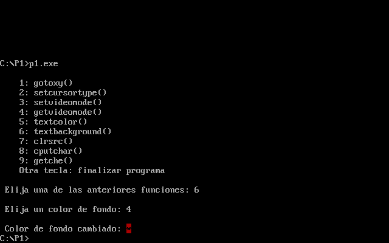

    [Pulse aquí para volver al inicio de las funciones obligatorias](#obg)  
    [Pulse aquí para volver al inicio de la página](#inicio)

-  **clrscr(): borrar toda la pantalla**

	Para este ejercicio, no se requiere ningún argumento: únicamente se modifican registros. De esta manera, con el registro AH se indica el número de función (6 en este caso) y mediante el registro AL se indican cuántas líneas se quieren desplazar en vertical hacia arriba. Como la idea es despejar toda la pantalla, fijamos un número alto para que se desplace todo el contenido existente en pantalla. Fijamos BH a 0 y a continuación indicamos la zona despejada: con CH y CL fijamos las coordenadas de la esquina superior izquierda y con DH y DL fijamos las de la esquina inferior derecha. Así pues, CH y CL toman valor 0 y DH y DL toman el mínimo valor necesario para que no quede ningún valor anterior en pantalla.

    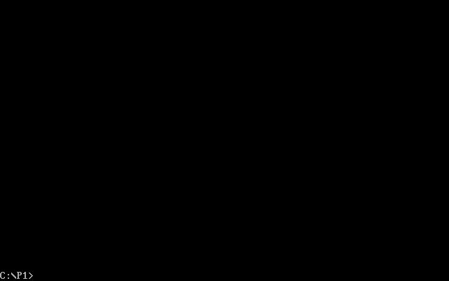

    [Pulse aquí para volver al inicio de las funciones obligatorias](#obg)  
    [Pulse aquí para volver al inicio de la página](#inicio)

-  **cputchar(): escribir un carácter en pantalla**

	Para este ejercicio, se necesita un argumento: el carácter que se quiere imprimir por pantalla, que se indica en el registro AL. Por lo demás, en el registro AH se indica que se hace uso de la función 9, fijamos BH a 0 y en BL fijamos tanto los colores del texto como del fondo. Los primeros cuatro bits del registro van destinados al color del fondo (y al parpadeo del carácter), mientras que el color del texto se fija con los últimos cuatro bits. Cada valor se asigna en función de las variables globales que se modifican con las funciones anteriormente mencionadas _textcolor()_ y _textbackground()_. Por último, en el registro CX se indica el número de repeticiones del carácter que se pasa como argumento y se guarda en el registro AL.

	A la hora de ejecutar esta función, a diferencia de lo que se va a hacer en el ejercicio siguiente, se lee la tecla mediante funciones estándar de C. Esto se ha hecho así para apreciar la especificidad de cada función sin que se superpongan entre ellas. Por ejemplo, la función _cputchar()_ utiliza el valor de la variable global _texto_ para imprimir la tecla pulsada.

    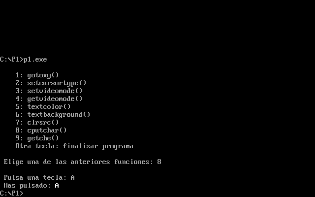

    [Pulse aquí para volver al inicio de las funciones obligatorias](#obg)  
    [Pulse aquí para volver al inicio de la página](#inicio)
	
-  **getche(): obtener un carácter de teclado (y mostrarlo)**
	
	Para este ejercicio, no se requieren argumentos, puesto que va implícito en el registro de salida AL. En este caso, lo único que hay que indicar es el número de función la interrupción a la que se llama con int86(). Aquí hay dos opciones: para mostrar la tecla pulsada inmediatamente después de pulsarla (como al escribir normal), la función a indicar en el registro AH es 1, y la interrupción correspondiente es 0x21. Por otra parte, si no se quiere mostrar la tecla pulsada, el valor correcto de AH es 0, y la interrupción 0x16. En este caso, vamos a quedarnos con la primera opción para que se muestre en pantalla la tecla pulsada.

	A la hora de ejecutar esta función, como se ha comentado anteriormente, se cambian ligeramente las llamadas a funciones para que, en este caso, el resultado dependa exclusivamente de la función _getche()_, imprimiendo la tecla pulsada con _printf()_ (además, como se comenta en el apartado anterior, ahora el color del carácter es el mismo que el del resto de elementos de consola, omitiendo la variable global _texto_).

    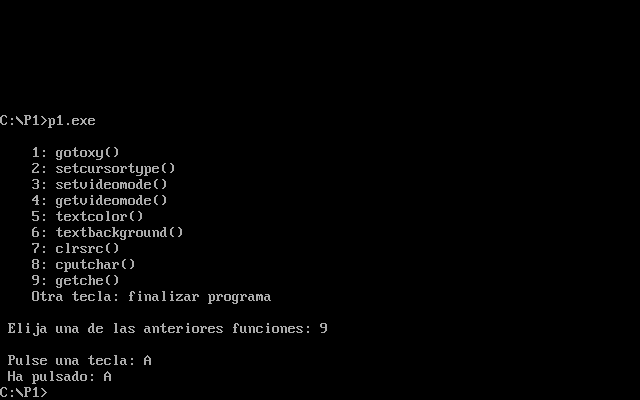

    [Pulse aquí para volver al inicio de las funciones obligatorias](#obg)  
    [Pulse aquí para volver al inicio de la página](#inicio)

###  Funciones opcionales

-  **recuadro(): dibujar un recuadro en la pantalla en modo texto**

  	Para este ejercicio, vamos a necesitar varios argumentos: las coordenaadas (x,y) de las esquinas superior izquierda e inferior derecha (que van a delimitar las dimensiones del recuadro), así como los colores de texto y fondo que van a rellenar el recuadro. Para esto, una vez hemos cambiado los dos últimos valores mencionados, basta con un doble bucle para avanzar tanto en el eje X como en el eje Y. Utilizamos la función _gotoxy()_ implementada anteriormente para poder movernos por toda la pantalla y llamamos a _cputchar()_ para darle color a lo que imprimamos por pantalla.

     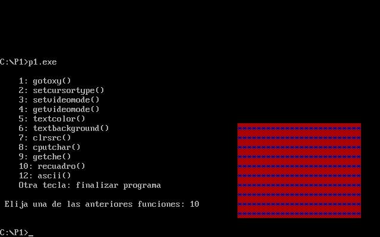

     [Pulse aquí para volver al inicio de las funciones opcionales](#opc)  
     [Pulse aquí para volver al inicio de la página](#inicio)
  
-  **CGA(): establecer modo gráfico CGA (modo = 4) para crear dibujos sencillos en pantalla**

  	Para este ejercicio, lo primero que vamos a utilizar va a ser la función _setvideomode()_ para cambiar el modo de vídeo al modo CGA, Una vez activado dicho modo, imprimimos por pantalla un asterisco mediante _cputchar()_, con el añadido de que simultáneamente, además de imprimir varios valores en la misma fila, se va cambiando el color del texto para hacerlo más heterogéneo. Para generar varias cascadas de asteriscos simultáneas, utilizamos _gotoxy()_ dentro de un bucle que va alejando la posición actual del (0,0).

     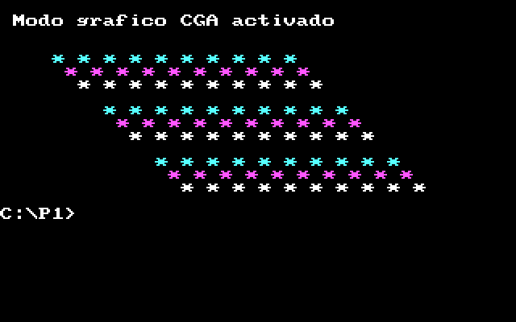

     [Pulse aquí para volver al inicio de las funciones opcionales](#opc)  
     [Pulse aquí para volver al inicio de la página](#inicio)
  
-  **ascii(): realizar un dibujo sencillo de tipo "ASCII art"**

  	Este ejercicio, más ameno y simple, no requiere de ninguna función externa, pues simplemente se trata de utilizar código ASCII para generar dibujos simples.

     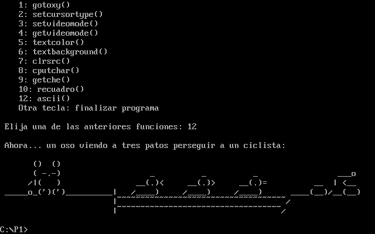

     [Pulse aquí para volver al inicio de las funciones opcionales](#opc)  
     [Pulse aquí para volver al inicio de la página](#inicio)
