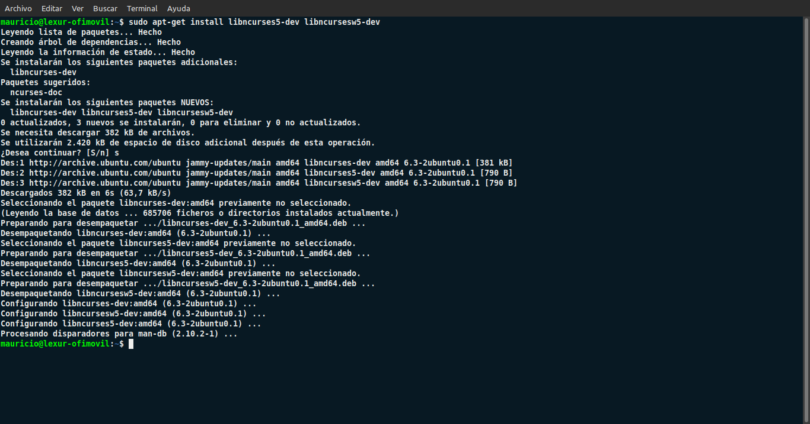
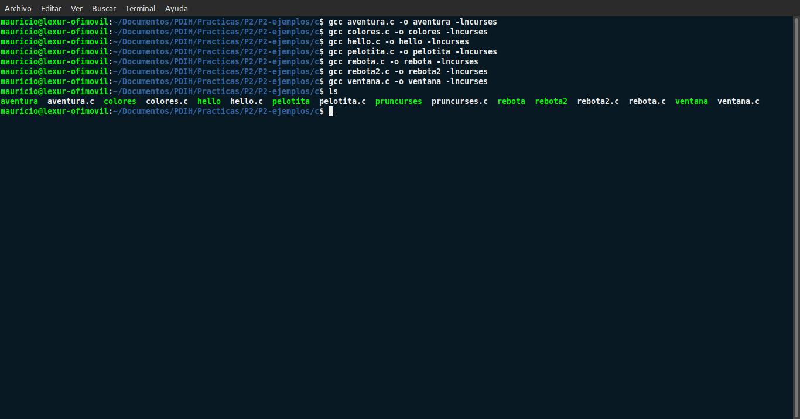
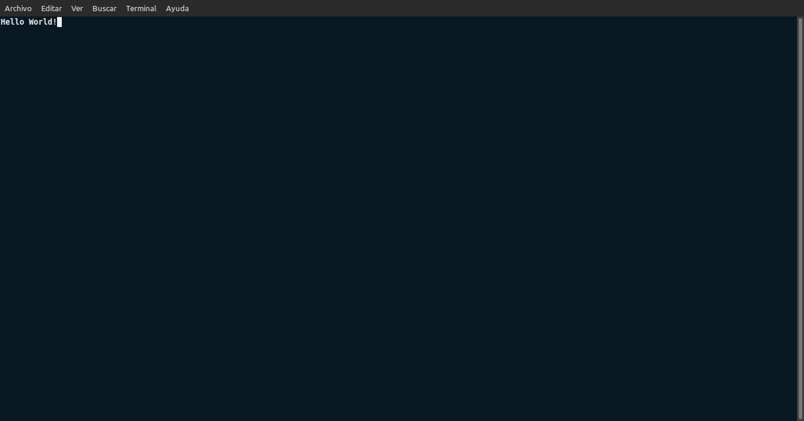
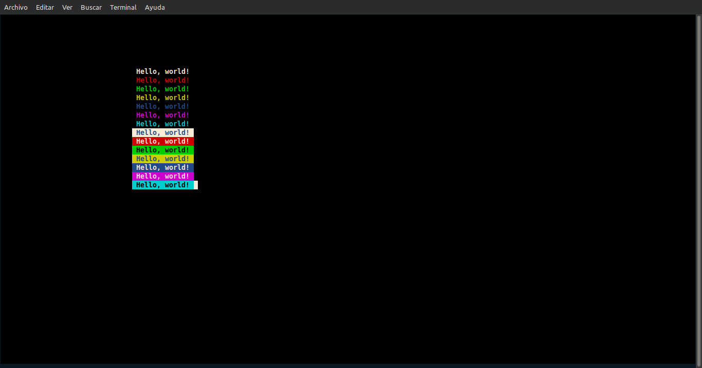
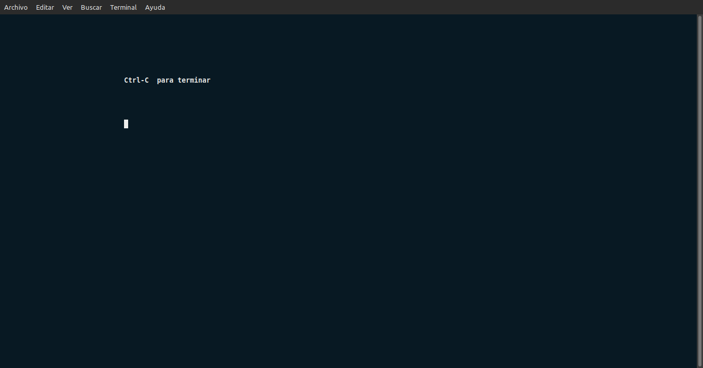
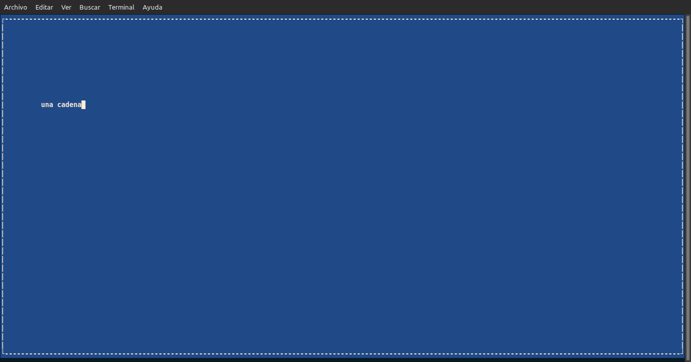
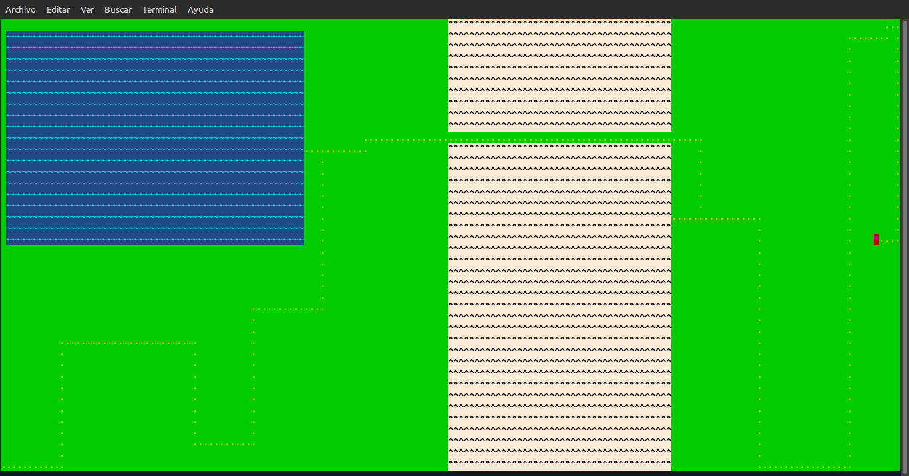
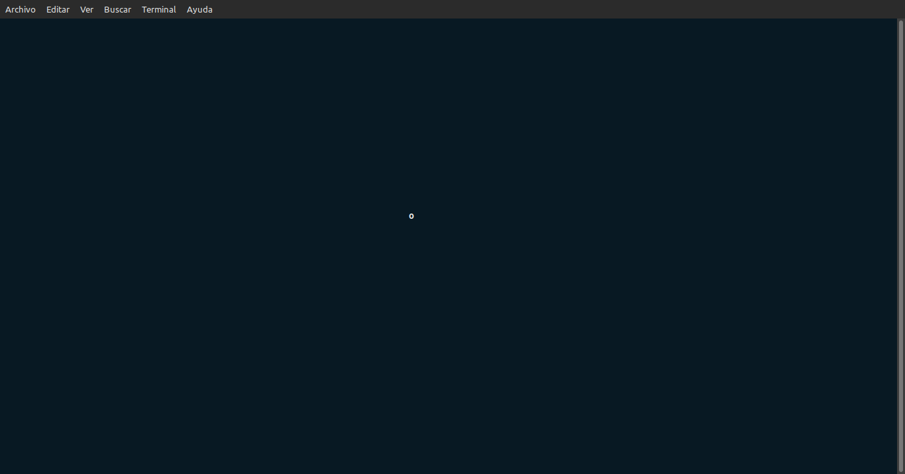
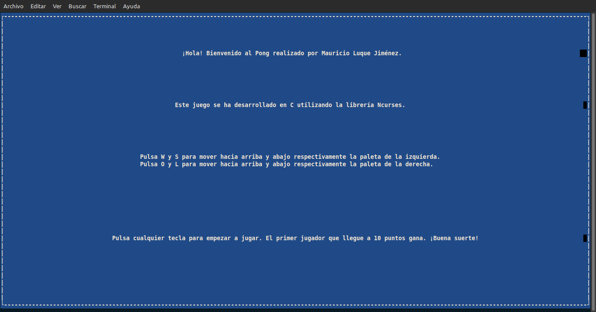

#   Práctica 2

##  Uso de bibliotecas de programación de interfaces de usuario en modo texto

###  Mauricio Luque Jiménez

#### Índice

- [Ejercicios obligatorios](#obg)
  - [Instalación de Ncurses](#ncurses)
  - [Desarrollo de Pong en C y Python](#pong)

- [Ejercicios opcionales](#opc)
  - [Menú de inicio](#menu_inicio)
  - [Menú de fin de partida](#menu_fin)

En esta práctica se va a proceder a instalar la librería Ncurses y hacer uso de ella diseñando el primer videojuego de la historia: el Pong. Se va a desarrollar tanto en C como en Python para mostrar cómo se utiliza la librería en distintos lenguajes de programación. Para ello, se tomarán como referencia los ejemplos proporcionados en esta práctica, así como otros desarrollos de Pong encontrados en portales como GitLab o GitHub. Adicionalmente, se agregarán menús de inicio y fin de partida para complementar el videojuego.

Todo el código de esta práctica está adjunto en el directorio /src, aunque eventualmente se incluirán algunas sentencias en próximos apartados.

##  Funciones obligatorias
###  Instalación de Ncurses

El paso inicial de esta práctica es instalar la librería Ncurses, que es la que nos va a proporcionar todas las funcionalidades de esta práctica. En este caso, la vamos a instalar en Linux (distribución Ubuntu), por lo que el comando a ejecutar en la terminal es el siguiente:

    sudo apt-get install libncurses5-dev libncursesw5-dev

Y el posterior resultado es el siguiente:

Una vez está la librería instalada, podemos proceder al desarrollo del Pong. Sin embargo, antes de eso, se van a probar algunos programas de ejempl, para lo que, a la hora de compilar, es necesario indicar que se está utilizando la librería Ncurses.

Estos programas de ejemplo que se van a probar brevemente antes del desarrollo del Pong son:

- Un pequeño Hola Mundo de bienvenida.

  

- Un programa para mostrar distintos pares de color de texto y fondo.

  

- Un programa que capta entrada de teclado para finalizar el programa.

  

- Un programa que crea una ventana cambiando el fondo y añadiendo un borde.

  

- Un programa para simular un juego de aventura en la que hay un terreno por el que hay zonas inaccesibles.

  

- Un programa que simula el rebote de una pelota en un movimiento horizontal y en unos límites específicos.

  

- Dos programas que simulan el rebote de una pelota por toda la pantalla y en todas direcciones (incluyendo la posibilidad de mover simultáneamente otro elemento).

  
  

[Pulse aquí para volver al inicio de las funciones obligatorias](#obg)  
[Pulse aquí para volver al inicio de la página](#inicio)

###  Desarrollo de Pong en C y Python
####  Desarrollo en C

Para esta parte, vamos a empezar explicando el código generado en C, que va a servir como idea general para luego mostrar la especificidad de la implementación en Python.

En primer lugar, es necesario destacar que el código se distribuye principalmente en tres funciones: _inicio()_, _pong()_ y _fin()_, a las que se llama desde la función principal del programa. En este apartado nos vamos a centrar en la segunda, puesto que la primera y la tercera las vamos a dejar para el apartado de ejercicios opciones.

Antes de pasar a la función en sí, hay que indicar una serie de variables globales y funciones auxiliares que se han implementado para aligerar las funciones principales y almacenar algunos datos. Las variables globales son:

- Coordenadas X e Y para delimitar el tamaño máximo de la pantalla (se van a utilizar en la mayoría de funciones, por lo que es más práctico declararlas una vez como variables globales y llamarlas una única vez en la función principal)

- Puntuaciones de los dos jugadores que van a controlar las paletas del Pong (se hace así para consultar los puntos de cada jugador tanto en _pong()_ como en _fin()_).

Además, se ha creado una estructura _object_ compuesta de dos enteros (coordenadas X e Y) que vamos a utilizar tanto para la pelota como para las paletas. Es decir, todos los elementos que intervienen en la partida.

    struct object {int x, y; };
    typedef struct object Object;

Por último, antes de explicar el propio código del juego, se han desarrolaldo tres funciones auxiliares para aclarar el código, puesto que se repiten más de una vez de forma idéntica cambiando algunos parámetros. Esas funciones son:

- _bool edge()_: Determina si la pelota ha llegado a un límite de la ventana.

      bool edge(int o, int dir, int max) { return (o + dir < 0 || o + dir >= max); }

  _o_ representa la coordenada X o Y (según el parámetro con el que se llame a la función) de la pelota (que se representa con una "o" minúscula, de ahí la nomenclatura). _dir_ representa el sentido del movimiento de la pelota (si es 1 se mueve hacia la izquierda o hacia abajo, si es -1 se mueve hacia la derecha o hacia arriba), de manera que se le añade a la posición de la pelota para moverse por los ejes X e Y. _max_ es el tamaño máximo de la pantalla, ya sea a lo ancho o a lo alto. Así pues, la función comprueba que el siguiente movimiento de la pelota sea fuera de los límites de la pantalla (en cuyo caso se devolvería _true_).

- _bool range()_: Determina si la posición de la pelota está en el rango de valores posibles de una paleta.

      bool range(Object o, Object paddle) { return (o.y >= paddle.y && o.y <= paddle.y + 6); }

    _o_ vuelve a representar a la pelota, aunque esta vez se pasa como Object en vez de como una simple coordenada ya que a diferencia de en _edge()_, en _range()_ sólo va a consultar el eje Y (puesto que la paleta no se mueve en el eje X). De sta manera, la llamada en _pong()_ es más sencilla. Lo mismo ocurre con _paddle_, que es la paleta cuya posición se quiere comparar con la pelota. En este caso, esta función es necesaria porque cada paleta es un conjunto de líneas, concretamente siete, por lo que no hay una única posición en la que puede colisionar la pelota. De esta manera, cualquiera de los seis valores de Y en los que está la paleta debe servir para que la pelota cambie de dirección. Al igual que en _edge()_, la función hace una comprobación y devuelve un booleano.

- _bool paddle()_: Determina si la posición de la pelota coincide con una paleta.

      bool paddle(int dir, int direction, Object o, Object paddle) { return (dir == direction && o.x == paddle.x - direction && range(o, paddle)); }

    Esta última función auxiilar comprueba que la pelota hace contacto con una paleta. De esta manera, _dir_ es el sentido del movimiento de la pelota (igual que en _edge()_), _direction_ es un valor con el que se compara _dir_ (sus posibles valores son 1 y -1), mientras que se vuelven a pasar como argumentos la pelota y la paleta. En este caso, se hace uso de la función _range()_ para hacer más legible la comprobación. Por ejemplo, si el sentido del movimiento es -1 (hacia la izquierda), la diferencia entre la coordenada X de la pelota y la de la paleta es 1 (se hace así para que no coincidan exactamente y no se solapen los dos objetos, sino que "rebote" al impactar) y la posición de la pelota está dentro del rango de posiciones de la paleta, la función devuelve _true_.

Una vez que hemos terminado con las variables globales y las funciones auxiliares, pasamos con la función dedicada al juego en sí. Dentro de esta función, lo primero que hacemos es declarar todas las variables que vamos a necesitar:

- Los objetos que representan la pelota (_o_), la paleta de la izquierda (_ws_) que se controla con las teclas "w" y "s" del teclado, y la paleta de la derecha (_ol_) que se controla con las teclas "o" y "l" del teclado.

      struct object o, ol, ws;

- El carácter _c_ que se va a leer para que el jugador pueda mover la paleta hacia arriba y hacia abajo.

      int c = 0;

- Dos variables _dir_ que permiten mover los objetos por el eje X y el eje Y (por defecto la pelota empieza moviéndose hacia la derecha y hacia abajo).

      int dir_y = 1, dir_x = 1;

- Las variables globales P1 y P2 se igualan a 0, pensando en un posible reinicio una vez terminada una partida (cada partida acaba cuando un jugador consigue 10 puntos, por lo que hay que reiniciar cada variable para volver a empezar a jugar).

      P1 = 0; P2 = 0;

Una vez se han declarado todas las variables, el primer paso es llamar a la función _nodelay()_ para que continúe la ejecución sin esperar entradas de teclado. Se limpia la pantalla y se coloca la pelota en una posición inicial: centrada en el eje X y en una posición aleatoria del eje Y (para que los rebotes no sean siempre los mismos y obligue a estar moviendo las paletas). Adicionalmente, se colocan las dos paletas (algo alejadas del límite) y comienza un bucle _while_ (cuya condición de parada es que ninguno de los dos jugadores tenga 10 puntos) que es el que marca la partida.

En la parte superior de la pantalla, mediante la función _mvprintw()_, se imprime el resultado de cada jugador, además de una línea que separa las dos mitades de la pantalla. [Esta línea (se hace uso de ACS_VLINE para que sea una línea continua, en lugar del carácter "|") se dibuja con _mvvline()_ para dibujar una línea vertical, cuyos parámetros son la coordenada Y inicial, la coordenada X inicial, el elemento que se quiere mostrar y la coordenada Y final](https://github.com/nasciiboy/NCURSES-Programming-HOWTO/blob/master/NCURSES-Programming-HOWTO-es.org). En este caso, la longitud de la línea va a ser 7 para tener un tamaño medio respecto a la pantalla. Posteriormente se dibujan la pelota, cuya posición inicial ya está definida, y las paletas, para las que se vuelve a usar ACS_VLINE.

Una vez está todo dibujado, pasamos al movimiento de la pelota y las colisiones con los límites de la pantalla (para lo que vamos a hacer uso de la función _edge()_). El primer paso es comprobar si la pelota colisiona con los límites superiores e inferiores de la pantalla (el eje Y), por lo que se cambiaría el sentido vertical del movimiento (_dir_y_ cambiaría su signo para invertir el movimiento por ese eje). Aparte, hay que comprobar si colisiona con los límites del eje X: si supera alguno de los límites, se cuenta un punto al jugador que lo haya marcado (además de volver a colocar la pelota en una posición de inicio e invertir su sentido en el eje X). Si no supera ningún límite, se comprueba que se ha topado con una de las dos paletas, por lo que se invierte el movimiento en el eje X. Una vez hechas todas estas comprobaciones, se cambia la posición de la pelota con _dir_x_ y _dir_y_.

El siguiente paso es leer por teclado alguno de los posibles movimientos de paletas disponibles, para lo cual hacemos un switch-case con las teclas elegidas para mover las paletas.

Finalmente, se llama a la función _usleep()_ para ralentizar la velocidad de la pelota y que se pueda seguir su desplazamiento, además de evitar parpadeos en la pantalla, y se llama a la función _refresh()_ para mandar todo lo anterior a la pantalla.

  [Pulse aquí para volver al inicio del desarrollo en C](#c)  
  [Pulse aquí para volver al inicio de las funciones obligatorias](#obg)  
  [Pulse aquí para volver al inicio de la página](#inicio)

####  Desarrollo en Python

Pasamos ahora con el desarrollo en Python, que si bien no cambia prácticamente ningún concepto del código desarrollado en C, sirve para comprobar el funcionamiento de la librería Ncurses en un lenguaje de programación diferente.

La principal diferencia respecto a C es que a cada llamada de una función de Ncurses hay que añadirle el objeto o la librería que realiza dicha llamada. Por ejemplo, para crear una ventana, en lugar de simplemente llamar a la función e incluir la ventana como argumento, la función forma parte del objeto que ejecuta el código. Mientras que este código en C es así:

    WINDOW *window = newwin(max_y, max_x, 0, 0);
    wbkgd(window, COLOR_PAIR(1));
    box(window, '|', '-');

En Python se escribe así;

    window = curses.newwin(max_y, max_x, 0, 0)
    window.bkgd(curses.color_pair(1))
    window.box('|', '-')

Por otra parte, hay algunas funciones que cambian ligeramente su declaración. Por ejemplificar este caso, en C:

    mvprintw(2, max_x / 2 - 2, "%i | %i", P1, P2);
    mvvline(0, max_x / 2, ACS_VLINE, max_y);

Estas funciones de imprimir por pantalla se nombran ligeramente diferente respecto a Python:

    stdscr.addstr(2, max_x // 2 - 2, f"{scores['P1']} | {scores['P2']}")
    stdscr.vline(0, max_x // 2, curses.ACS_VLINE, max_y)

Además, también cambia la llamada a las funciones auxiliares, que se comentarán más tarde, _inicio()_ y _fin()_. Mientras que en C esas funciones no tienen ningún argumento, en Python requieren de un argumento que represente la pantalla completa (_stdscr_). De esta manera, las funciones generales se verían así en C:

    inicio();
    pong();
    restart = fin();

    clear();
    refresh();

En Python se ven así:

    inicio(stdscr)
    pong(stdscr)
    restart = fin(stdscr)

    stdscr.clear()
    stdscr.refresh()

Otra diferencia viene a la hora de definir el objeto utilizado para la pelota y las paletas. Mientras que en C se usa un _struct_ con dos argumentos, en Python es una clase con su propio constructor (requerido para inicializar instancias, a diferencia de C).

    o = object(max_x // 2, random.randint(0, max_y))
    ol = object (max_x - 5, max_y // 2)
    ws = object (5, max_y // 2)

Eso sí, por el tipado dinámico de Python, no hay que especificar la clase a la hora de utilizar las funciones auxiliares, que son bastante similares en ambos lenguajes.

Por último, más por una cuestión de utilizar diferentes estructuras de datos nativas de Python, se ha utilizado un diccionario para almacenar las puntuaciones de los dos jugadores, mientras que en C, aunque se podrían agrupar en un vector para organizarlo de forma similiar, se ha optado por declararlas como variables independientes. Lo que no cambia es que son variables globales que en el método _pong()_ se tienen que inicializar a 0 para poder reiniciar el juego.

Dichas variables, en C aparecen así:

    while(P1 != 10 && P2 != 10)

    if (o.x < max_x / 2) P2++;
    else P1++;

Y en Python aparecen así:

    while scores['P1'] != 10 and scores['P2'] != 10:

    if o.x < max_x // 2: scores['P2'] += 1
    else: scores['P1'] += 1

  [Pulse aquí para volver al inicio del desarrollo en Python](#py)  
  [Pulse aquí para volver al inicio de las funciones obligatorias](#obg)  
  [Pulse aquí para volver al inicio de la página](#inicio)

##  Funciones opcionales
###  Menú de inicio

Para el menú de inicio, lo primero que se hace dentro de la función es crear el par de colores que vamos a utilizar: blanco para el texto y azul para el fondo.

Después de eso, y de despejar la pantalla, se crea una mediante _newwin()_, con las dimensiones máximas obtenidas de las variables globales, de manera que se cubra todo el espacio posible. Con la función _wbkgd()_ se elige el par de colores creado previamente y, además, llamamos a la función _box()_ para crear unos bordes en los límites de la pantalla.

Finalmente, se imprimen por pantalla un mensaje de bienvenida, una breve información del juego, una explicación de los controles y una indicación de pulsar una tecla cualquiera (que se lee mediante la función _getch()_ del final) para empezar el juego.

###  Menú de fin de partida

Para el menú del final, lo primero que debemos hacer es llamar a la función _nodelay()_, que después de ejecutar la función del juego había sido declarada TRUE, para que espere a la pulsación de una tecla antes de terminar su ejecución. Se crean tanto el par de colores como la pantalla como hemos visto anteriormente, se muestran los resultados almacenados en las variables globales de los jugadores (además de mostrar un mensaje indicando quién ha ganado la partida) y se pide la pulsación de "r" para volver a jugar, o de "q" para salir del juego. Se imprime todo por pantalla y se devuelve una variable _restart_ a la que se le pasa la última entrada de teclado.

De esta manera, todas estas funciones se ejecutan en un _main()_ en el que se inicializa el modo _ncurses_, se inicializan algunos valores como el tamaño máximo de la pantalla y el par de colores de texto y fondo que queremos aplicar en las ventanas de inicio y final de partida, se llama a la función inicio y a la función _pong()_. Cuando termina una partida, se entra en un bucle _while_ (que nunca se detiene, ya que eso es responsabilidad del usuario que decide salir del juego), que pide una entrada de teclado constantemente hasta que sea una de dos opciones: reiniciar partida o salir (si no es ninguna de esas dos, simplemente reinicia el bucle una y otra vez esperando respuesta). Una vez que se sale del bucle (cuando la tecla pulsada es la "q"), se cierra la ventana definitivamente.

    int main()
    {
      char restart;
    
      initscr();
      curs_set(FALSE);
      noecho();
    
      getmaxyx(stdscr, max_y, max_x);
    
      start_color();
      init_pair(1, COLOR_WHITE, COLOR_BLUE);
    
      inicio();
      pong();
    
      while (true)
      {
        restart = fin();
        if (restart == 'r' || restart == 'R') pong();
        if (restart == 'q' || restart == 'Q') break;
      }
    
      endwin();
    
      return 0;
    }

Aquí una pequeña muestra del programa completo, con el marcador limitado hasta 3 puntos.

https://github.com/mauricioluquejimenez/PDIH/assets/72136756/8a1b9569-8e16-46fb-b5fe-4c9bca69ed50

  [Pulse aquí para volver al inicio de las funciones opcionales](#opc)  
  [Pulse aquí para volver al inicio de la página](#inicio)

  ### Enlaces y repositorios de referencia para Ncurses y Pong

  - [Repositorio de GitHub sobre Ncurses](https://github.com/nasciiboy/NCURSES-Programming-HOWTO)
  - [Repositorio de GitHub de Vicente Boela](https://github.com/vicentebolea/Pong-curses)
  - [Repositorio de GitHub de Martino Pilia](https://github.com/m-pilia/pong)
