#   Práctica 5

##  Experimentación con el sistema de salida de sonido

###  Mauricio Luque Jiménez

#### Índice
- [Leer dos ficheros de sonido (WAV o MP3) de unos pocos segundos de duración cada uno](#1)
- [Dibujar la forma de onda de ambos sonidos](#2)
- [Obtener la información de las cabeceras de ambos sonidos](#3)
- [Unir ambos sonidos en uno nuevo](#4)
- [Dibujar la forma de onda de la señal resultante](#5)
- [Pasarle un filtro de frecuencia para eliminar las frecuencias entre 10000Hz y 20000Hz](#6)
- [Almacenar la señal obtenida como un fichero WAV denominado “mezcla.wav”](#7)
- [Cargar un nuevo archivo de sonido, aplicarle eco y a continuación darle la vuelta al sonido](#8)

En esta práctica se va a realizar una introducción al manejo de salida de sonido. Para ello, se van a utilizar archivos en formato de onda (_.wav_) en el programa R-Studio.

Antes de realizar los ejercicios propuestos sobre manejo de sonido, es conveniente indicar el modus operandi del código en R para poder darlo por explicado en cada uno de las actividades. Esencialmente, el código R se va a basar en objetos que van a representar los distintos sonidos a crear, leer y modificar, de una manera similar a como funcionan las variables en lenguajes como Python o PHP.

###  Leer dos ficheros de sonido (WAV o MP3) de unos pocos segundos de duración cada uno

Lo primero que vamos a hacer va a ser generar los audios con los que se va a trabajar en todos los ejercicios posteriores. Para ello, vamos a hacer uso del conversor de texto a audio eSpeak, invocándolo desde la línea de comandos. En nuestro caso, se van a grabar dos sonidos en dos archivos _WAV_ independientes: uno con el nombre del autor de la práctica (_Mauricio_) y otro con el primero apellido (_Luque_).

El primer paso es instalar la librería, como se muestra a continuación:

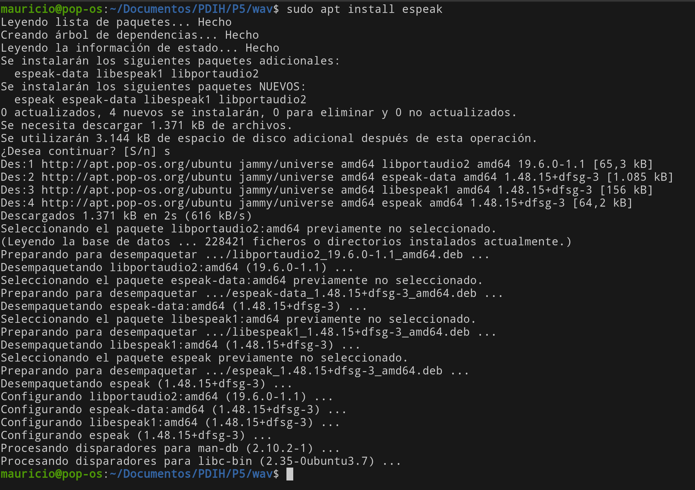

Y una vez hecho esto, podemos proceder a grabar los audios:

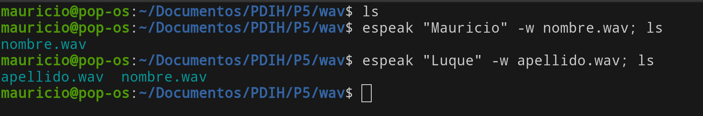

Ahora que ya tenemos los audios disponibles, nos toca entrar a R-Studio. El paso inicial es instalar y llamar a dos librerías que vamos a necesitar para tratar con audio, ondas y frecuencias sonoras. Por otra parte, también vamos a indicarle al entorno de desarrollo que el directorio base de trabajo va a ser el directorio en el que están situados los archivos de audio, para evitar direccionamientos complejos.

Una vez lo tenemos todo listo para empezar a manejar archivos de audio, leemos los ficheros creados con eSpeak:

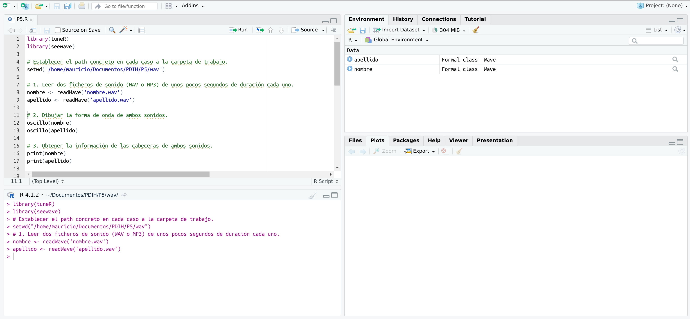

###  Dibujar la forma de onda de ambos sonidos

Una vez le hemos pasado a R-Studio los primeros ficheros con los que vamos a trabajar, le pedimos que dibuje su forma de onda con la función _oscillo()_. También se podría utilizar, en estos primeros ejercicios, la función _plot()_, ya que el funcionamiento y la sentencia de código es bastante similar, pero pensando en ejercicios posteriores, vamos a utilizar _oscillo()_ desde el principio.

De esta manera, obtenemos esta onda para el audio relativo al nombre:

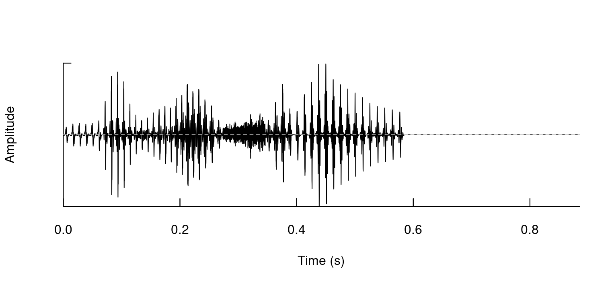

Y esta onda para el audio relativo al apellido:

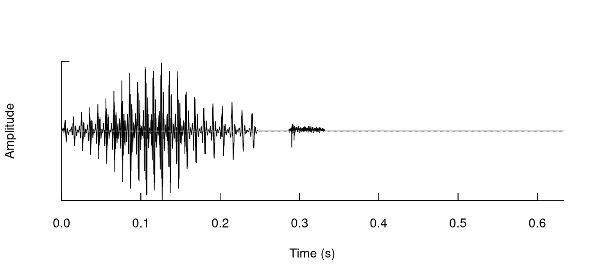

###  Obtener la información de las cabeceras de ambos sonidos

Para obtener información de los audios, hacemos un _print()_ de cada uno de ellos. Así se vería ejecutado en el entorno de R-Studio.

La información del nombre:

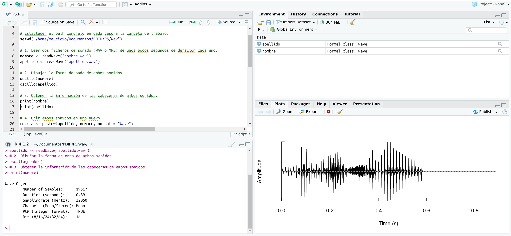

Y la información del apellido:

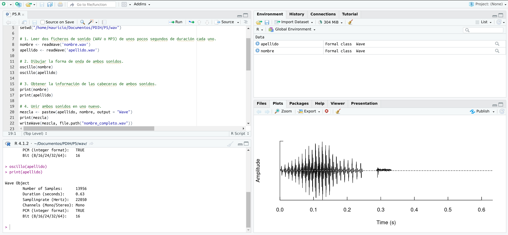

###  Unir ambos sonidos en uno nuevo

Ahora que ya hemos conocido los detalles de cada audio por separado, vamos a unirlos mediante la función _pastew()_, a la que le indicaremos que el audio _apellido_ se le añade al audio _nombre_ y que el sonido resultante es una salida de tipo onda (_output = "Wave"_).

Éste es el resultado de la fusión de ambos audios, mostrando información de cabecera con la función _print()_:

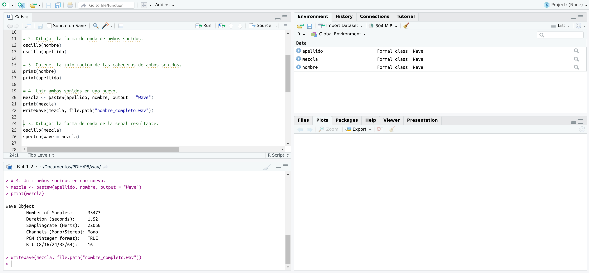

###  Dibujar la forma de onda de la señal resultante

Aunque se ha mostrado anteriormente al mostrar el resultado de la unión de ambos audios, para obtener la forma de onda de la señal fusionada hay que llamar, al igual que se ha hecho con cada audio por separado, a la función _plot()_, dando este resultado:

Que, evidentemente, es la unión exacta de los dos audios iniciales. Para poder compararla con el siguiente ejercicio, guardaremos el sonido en un fichero _nombre_completo.wav_, mediante la función _writeWave()_, que se explicará brevemente cuando queramos guardar la señal del siguiente ejercicio.

De manera adicional, para ver mejor las frecuencias del audio combinado, se ha ejecutado la función _spectro()_, que va a representar de manera más visual las distintas frecuencias del sonido.

Así se ve el espectro de frecuencias del audio combinado:

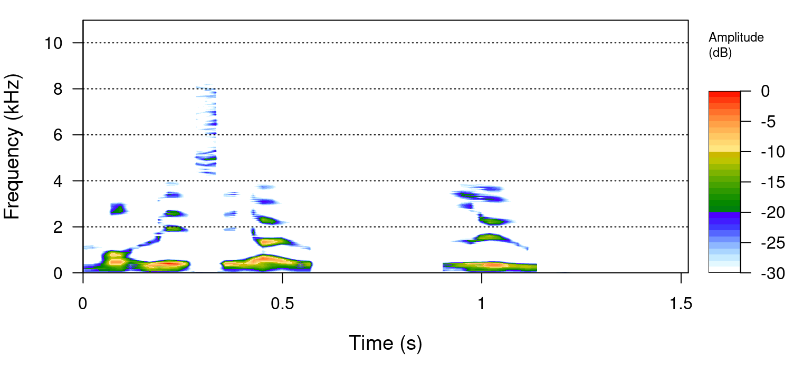

###  Pasarle un filtro de frecuencia para eliminar las frecuencias entre 10000Hz y 20000Hz

Para este ejercicio, lo primero que vamos a hacer va a ser obtener la frecuencia del audio que hemos generado en los ejercicios anteriores, ya que va a ser un parámetro importante en la resolución del ejercicio. Esto lo conseguimos con la siguiente línea de código:

    fs <- mezcla@samp.rate

Siendo _fs_ el valor al que asignamos el rango de frecuencia del objeto _mezcla_. También, aunque no sea estrictamente necesario, vamos a cambiar el tipo de dato de _fs_, convirtiéndolo de un número entero a un tipo de dato _numeric_, con la función _as.numeric()_. Con esto, conseguimos pasar de esto:

    fs = 22050L

A esto:

    fs <- as.numeric(fs)
    fs = 22050

Una vez tenemos la frecuencia del audio disponible, podemos aplicar el filtro de frecuencia con la función _fir()_.

Los parámetros que le vamos a pasar a la función son:

- El audio (onda) que se va a filtrar
- La frecuencia del audio (el valor _fs_ que hemos comentado anteriormente)
- El límite inferior y superior de frecuencias a evaluar
- El tipo de filtro, en función de si elimina los valores contenidos en el rango especificado (_bandpass = FALSE_) o de si son los únicos que acepta mientras que adapta el resto de frecuencias (_bandpass = TRUE_)
- El tipo de salida (concretamente vamos a utilizar una salida de onda)

En este caso, como lo que queremos realizar es un filtro de rechazo de banda (eliminar un determinado rango de frecuencias), vamos a poner la variable _bandpass_ a falso. Por otra parte, como hemos podido ver en el espectro anterior, eliminar el rango de frecuencias entre 10 KHz y 20 KHz es como no hacer nada, porque no hay frecuencias tan altas. De esta manera, vamos a elegir límites de menor frecuencia para que la diferencia sea notoria. Por lo tanto, vamos utilizar el rango entre los 2 KHz y los 4 KHz, que abarca exactamente una franja del espectro.

Una vez explicados los valores que vamos a modificar, podemos ejecutar la función para aplicar el filtro de frecuencias, obteniendo el siguiente resultado:

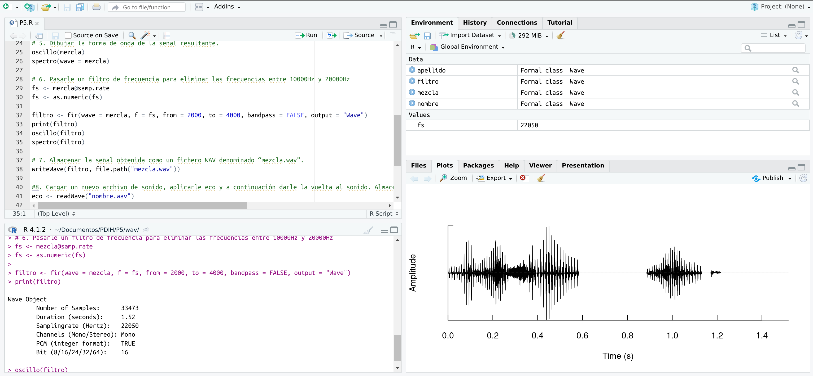

Y la consecuente onda:

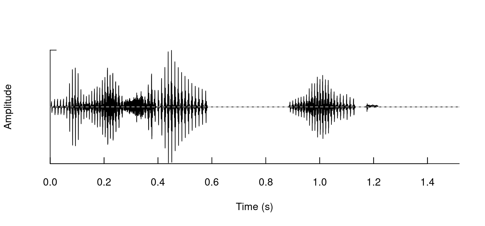

Por último, se puede apreciar en el espectro de frecuencias (obtenido mediante la función _spectro()_), cómo se han eliminado exactamente las frecuencias incluidas en el rango indicado.

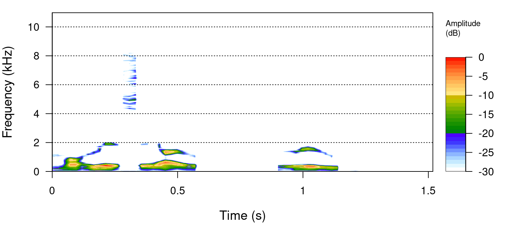

###  Almacenar la señal obtenida como un fichero WAV denominado “mezcla.wav”

Una vez le hemos pasado el filtro de frecuencia a la mezcla, únicamente nos queda guardar el archivo, cosa que hacemos con la función _writeWave()_, a la que le pasamos el objeto _mezcla_, al que le hemos aplicado el filtro, y la dirección donde queremos que se guarde el archivo resultante. En este caso, al haber asignado el directorio base al principio del programa, únicamente hace falta especificar el nombre del archivo, que será _mezcla.wav_.

###  Cargar un nuevo archivo de sonido, aplicarle eco y a continuación darle la vuelta al sonido

Por último, vamos a cargar un archivo de sonido, en este caso el del nombre que hemos utilizado anteriormente, y vamos, en primer lugar, a aplicarle eco. Esto lo hacemos con la función _echo()_, a la que le especificamos la frecuencia del audio, los diferentes valores de amplificación del sonido (al ser eco van a ser valores decrecientes) y el intervalo de tiempo entre cada sonido. De esta manera, así se ve este proceso en R-Studio:

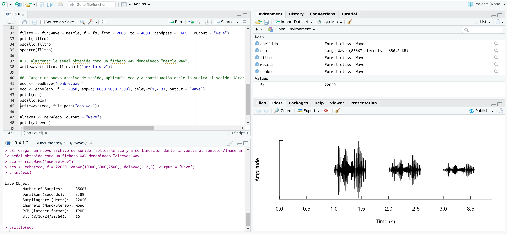

Siendo esta la onda resultante:

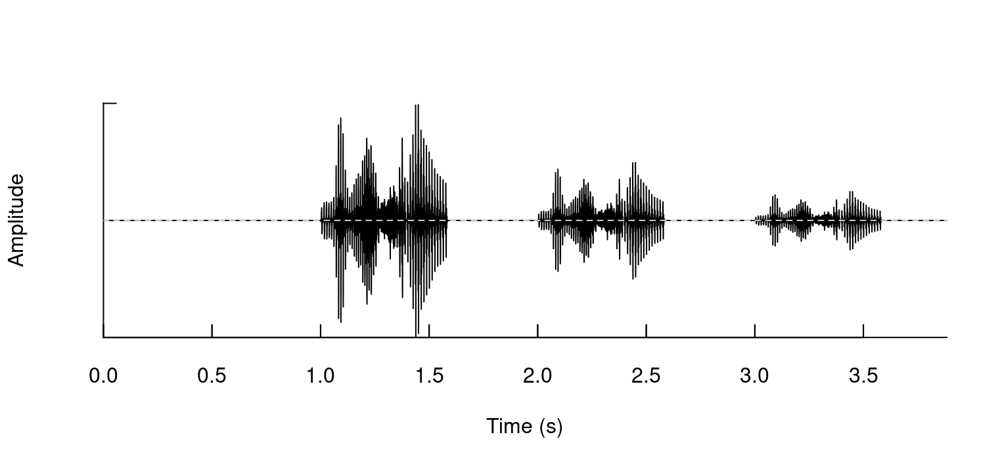

Finalmente, invertimos el sonido llamando a la función _revw()_ y guardamos el resultado en el archivo _alreves.wav_.

Así se ve en R-Studio:

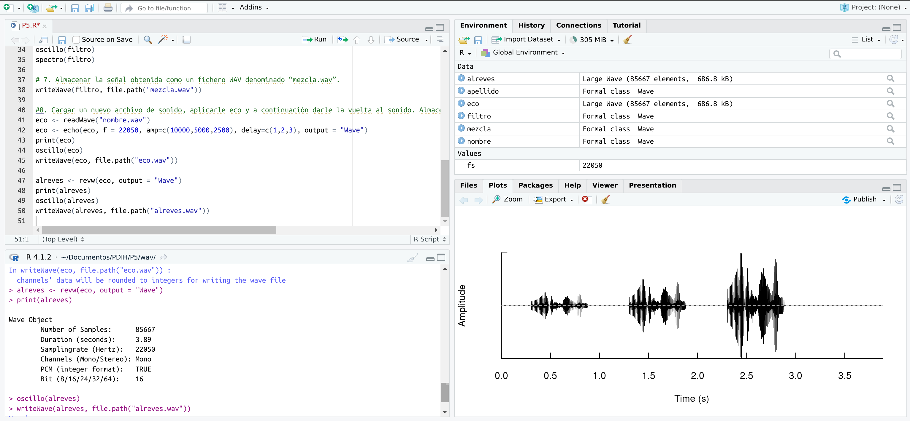

Y así es la onda final:

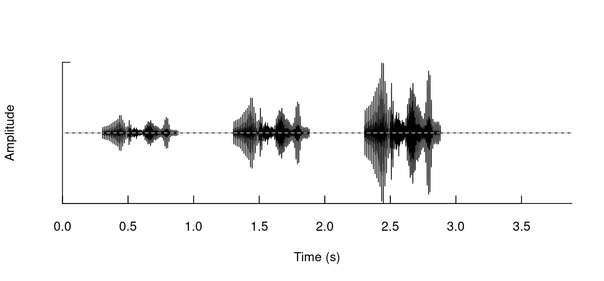

## Bibliografía y referencias
- https://cran.r-project.org/web/packages/seewave/seewave.pdf
- https://www.rdocumentation.org/packages/seewave/versions/2.2.3/topics/bwfilter
- https://es.wikipedia.org/wiki/Filtro_paso_banda
- https://es.wikipedia.org/wiki/Filtro_elimina_banda
- http://carina.fcaglp.unlp.edu.ar/senales/apuntes/frec_Nyquist.pdf
- https://static.uvq.edu.ar/mdm/TSD/unidad-05-07.html