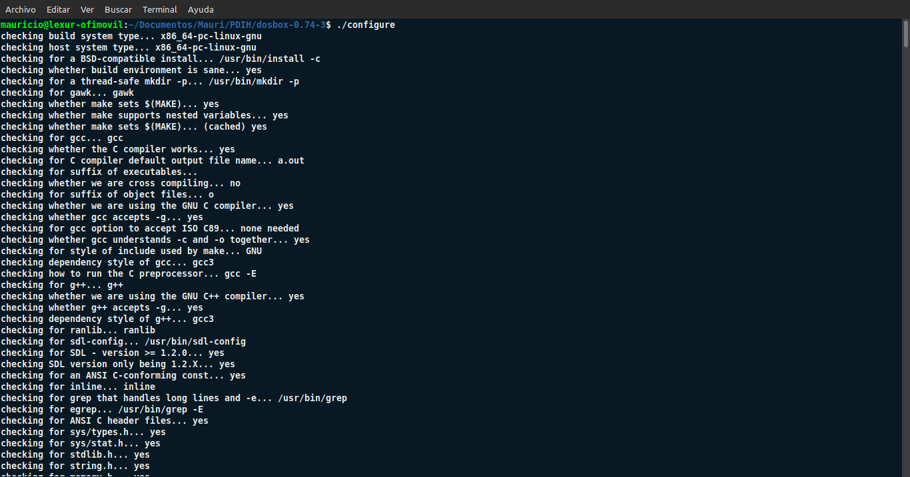
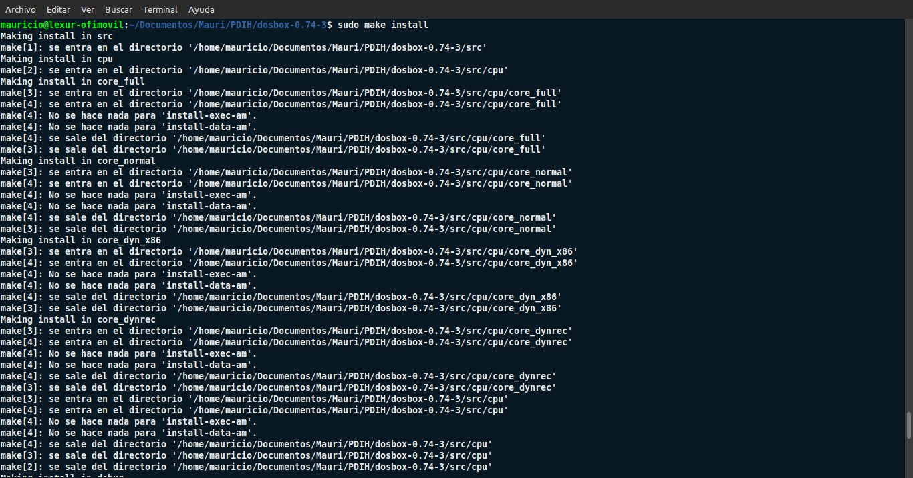
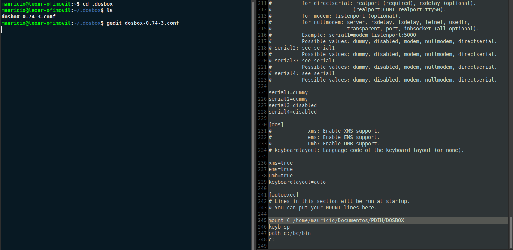
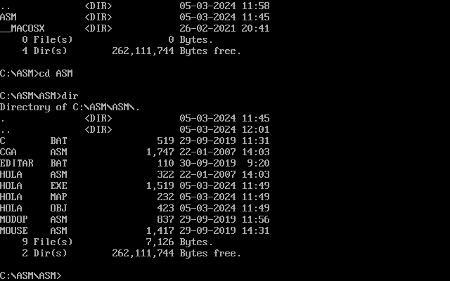
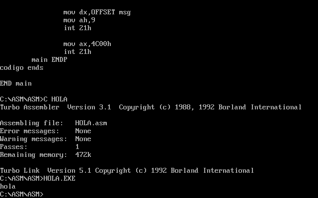
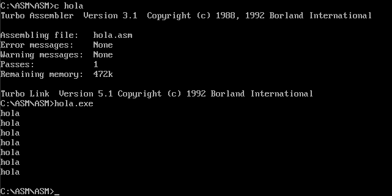

#   Seminario 1

##  Programación de dispositivos a bajo nivel

###  Mauricio Luque Jiménez

####  Índice

- [Instalación de DOSBOX](#instalacion)
- [Configuración inicial ](#configuracion)
- [Primer programa de ejemplo](#helloworld)

En este seminario se va a proceder a instalar el software DOSBOX, así como hacer una configuración inicial y unas primeras pruebas para comprobar su funcionamiento de cara a posteriores prácticas.

###  Instalación de DOSBOX

El primer paso a realizar es instalar el software en nuestro equipo. Como se puede ver en la primera captura, ya tenemos el comprimido dentro del directorio personal PDIH. Si vemos su contenido, se encuentra todo lo necesario para su instalación y configuración.

Vemos remarcado en verde el fichero _configure_, que es lo primero que vamos a ejecutar. En este caso, se nos pide la versión 1.2.0 de SDL, la librería que vamos a utilizar para la programación a bajo nivel y a nivel gráfico.

El siguiente paso es instalar por consola el paquete _make_ para la compilación del código que vamos a programar en este seminario y en posteriores prácticas.

Una vez que hemos completado todos estos pasos, ya tenemos disponible el ejecutable de DOSBOX en el directorio /usr/local/bin.

El resto de pasos se van a realizar dentro del emulador DOSBOX, que ya está disponible para su utilización.

[Pulse aquí para volver al inicio de la instalación](#instalacion)  
[Pulse aquí para volver al inicio de la página](#inicio)

###  Configuración inicial

Una vez hemos instalado el emulador, el siguiente paso es configurar opciones de inicio y las unidades que queremos montar en DOSBOX, para lo cual editaremos el fichero .conf. Concretamente, añadiremos cuatro líneas al final que indicarán:

- El directorio de nuestro equipo en el que se va a montar el disco C: de DOSBOX.

        mount C /home/mauricio/Documentos/PDIH/DOSBOX

- El teclado por defecto, en este caso el español.

        keyb sp

- La dirección de las utilidades de compilación que se van a usar apra programar.

        path c:/bc/bin

- El directorio de arranque del emulador, en este caso C:.

        c:

Después de guardar dichos parámetros, basta con arrancar DOSBOX para comprobar que los cambios se han guardado e introducido correctamente.

Además, podemos inspeccionar los directorios que contiene el emulador (los que se han instalado junto con el compilador para poder empezar a trabajar en las prácticas posteriores). En concreto, vemos que el directorio _C:\ASM\ASM_ contiene los ficheros en código ensamblador que vamos a compilar y ejecutar a continuación.

[Pulse aquí para volver al inicio de la configuración](#configuracion)  
[Pulse aquí para volver al inicio de la página](#inicio)

###  Primer programa de ejemplo

Ahora que tenemos todo el emulador configurado, podemos empezar a compilar y ejecutar código en ensamblador. Lo primero que vamos a hacer va a ser inspeccionar el código del fichero más básico del directorio, _HOLA.ASM_.

Podemos compilarlo escribiendo en la línea de comandos la siguiente instrucción:

        c hola

Y con esto, escribimos en la línea de comandos

        hola.exe

y vemos el resultado impreso por pantalla:

Visto el resultado del fichero básico, el siguiente paso es modificar el código ensamblador para que, en vez de mostar "hola" una sola vez, genere un bucle que lo imprima siete veces por pantalla. Para esto, hay que indicar un retorno de carro de la siguiente forma:

        msg db 'hola', 10, '$'

Y creando un bucle indicando que el mensaje 'hola' con retorno de carro se repita hasta que el registro _CX_, que incrementa su valor con cada iteración, sea igual a 7.

        bucle:
            mov dx, OFFSET msg
            mov ah, 9
            int 21h

            int cx
            cmp cx, 7
            jne bucle

De esta manera, vemos como el resultado de la ejecución varía de forma satisfactoria respecto a su estado inicial.

[Pulse aquí para volver al inicio del primer programa de ejemplo](#helloworld)  
[Pulse aquí para volver al inicio de la página](#inicio)