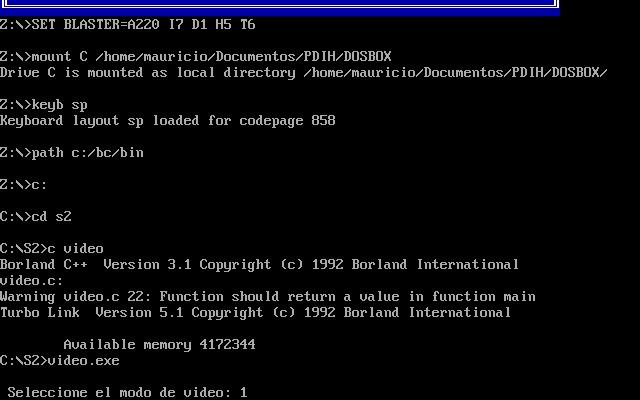
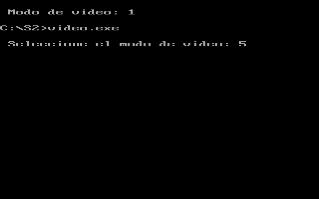
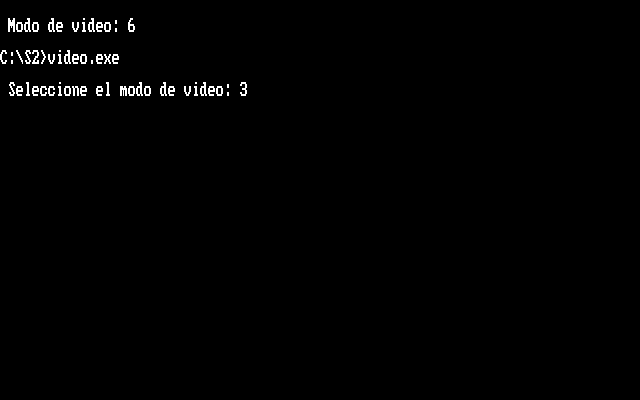
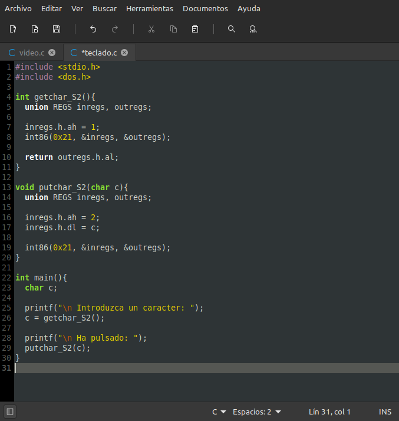
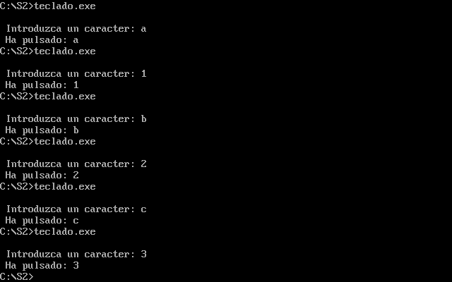

#  Seminario 2

## Acceso a dispositivos de E/S en C

### Mauricio Luque Jiménez

#### Índice

  - [Cambio de modo de vídeo](#video)
  - [Lectura de caracteres desde teclado y muestra por pantalla](#teclado)

En este seminario se va a hacer una breve introducción a la gestión de registros de E/S en C, con la ayuda de dos pequeños programas que servirán posteriormente en siguientes prácticas. Para el posible uso de las funciones sin sobreescrituras con otras librerías, se ha optado por añadir el sufijo _S2_ a todas las funciones.

###  Cambio de modo de vídeo

Para esta función se necesita un argumento de entrada: el modo de vídeo al que se desea cambiar. Por comodidad de uso y para posteriores prácticas, este argumento será de tipo _char_, ya que su longitud en bits es la misma que un dato de tipo _BYTE_. Ese argumento irá al registro _AL_, mientras que en el registro AH indicamos el número de función 0. Como no tiene salida, lo único que nos queda es llamar a la función _int86()_ con los registros que se han creado al principio de la función.

Para comprobar el funcionamiento de esta función, el programa es muy sencillo: se lee por pantalla el modo de vídeo deseado y se llama a la función para mostrarlo por pantalla.

A continuación, unas cuantas img para mostrar su compilación y varios ejemplos de ejecución, mostrando los distintos modos de vídeo disponibles.

[Pulse aquí para volver al inicio de la función](#video)   
[Pulse aquí para volver al inicio de la página](#inicio)

###  Lectura de caracteres desde teclado y muestra por pantalla

Para este programa, el procedimiento es similar al del ejercicio anterior. En primer lugar tenemos la función para leer caracteres desde el teclado, a la que sólo tenemos que indicarle el número de función (1) y el valor devuelto, que en este caso es el registro de salida _AL_.

En segundo lugar tenemos la función para imprimir por pantalla, cuyo número de función escrito en el registro _AH_ es 2. En este caso, el único paso adicional es guardar el carácter _c_ (introducido como argumento de la función), en el registro _DL_.

A continuación, unas cuantas img para mostrar su compilación y varios ejemplos de ejecución, mostrando diferentes entradas de teclado.

[Pulse aquí para volver al inicio de la función](#video)   
[Pulse aquí para volver al inicio de la página](#inicio)