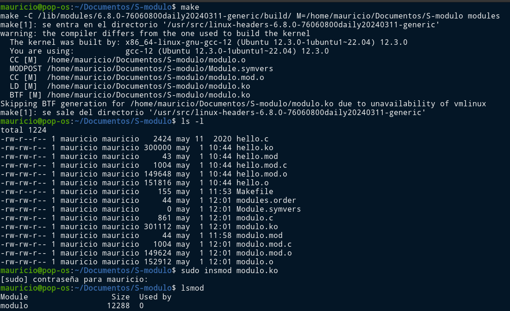

#   Seminario

##  Módulos cargables del kernel (LKM)

###  Mauricio Luque Jiménez

####  Índice

- [Primera toma de contacto y manejo del módulo de prueba](#hello)
- [Desarrollo del módulo propio y comprobación de su funcionamiento](#modulo)

En este seminario se va a trabajar con módulos cargables del kernel. Primeramente se va a comprobar el funcionamiento de los mismos mediante un módulo de prueba, para posteriormente desarrollar un módulo propio.

##  Primera toma de contacto y manejo del módulo de prueba

El primer apartado se va a dedicar a probar el código proporcionado y comprobar el funcionamiento de los módulos cargables del kernel. El paso inicial, antes del propio módulo, es asegurarse de tener las cabeceras disponibles, lo cual, en este caso, viene de serie.

Después de compilar el código en C con el Makefile proporcionado, obtenemos el LKM que se va a insertar a continuación.

Así pues, podemos ver el módulo correctamente insertado, así como consultarlo para obtener su respectiva información.

Finalmente, una vez hemos comprobado que se ha insertado en el kernel, podemos proceder a eliminarlo y a comprobar la salida en el log del kernel.

[Pulse aquí para volver al inicio del manejo del módulo de prueba](#hello)   
[Pulse aquí para volver al inicio de la página](#inicio)

##  Desarrollo del módulo propio y comprobación de su funcionamiento

Una vez hemos tenido una primera muestra de contacto, podemos pasar al desarrollo de nuestro propio módulo. Se va a tratar de un módulo sencillo, que cuando se inicialice va a dar como salida la versión y el autor del mismo. Para ello, en lugar de una única variable _name_ como la que se creaba en el código de prueba, aquí se van a crear dos, _version_ y _autor_, que también van a tener sus respectivas descripciones cuando se llame al comando _modinfo_.

    static char *autor = "Mauricio Luque Jiménez";
    static char *version = "1.0";

    module_param(autor, charp, S_IRUGO);
    module_param(version, charp, S_IRUGO);

    MODULE_PARM_DESC(autor, "El autor de este módulo de kernel");
    MODULE_PARM_DESC(version, "La versión del módulo");

De este modo, las propiedades del módulo serían las siguientes:

    MODULE_LICENSE("Mi licencia");
    MODULE_AUTHOR("Mauricio Luque Jiménez");
    MODULE_DESCRIPTION("Un pequeño módulo personal desarrollado para este seminario");
    MODULE_VERSION("1.0");

Y por otra parte, las funciones de inicialización y finalización del módulo, en este caso llamadas _init_modulo_ y _exit_modulo_ respectivamente, incluyen ambos parámetros en sus sentencias.

    static int __init init_modulo(void)
    {
      printk(KERN_INFO "El módulo, de versión %s, desarrollado por %s ha sido cargado en el kernel", version, autor);
      return 0;
    }

    static void __exit exit_modulo(void) { printk(KERN_INFO "El módulo ha sido eliminado del kernel"); }

Por último, además de los cambios en el código en C, hay que modificar ligeralmente el Makefile para que apunte a un nuevo LKM:

    obj-m+=modulo.o

Finalmente, una vez explicado el código, funcionamiento y las llamadas al módulo son idénticos.

[Pulse aquí para volver al inicio del desarrollo del módulo propio](#modulo)   
[Pulse aquí para volver al inicio de la página](#inicio)
