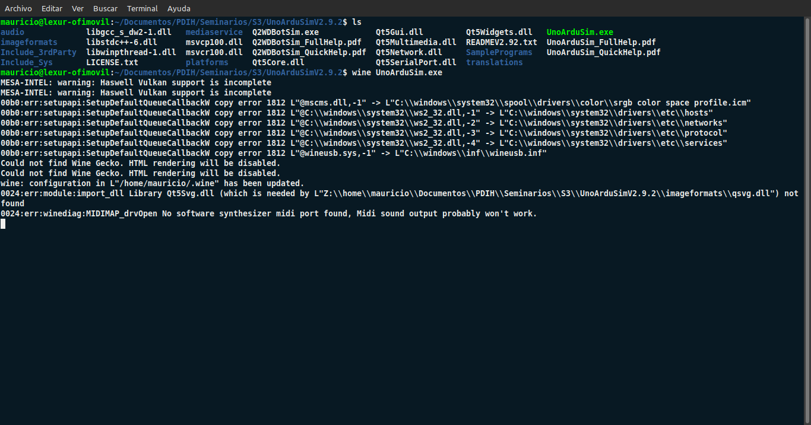

#   Seminario 3

##  Uso del simulador de Arduino

###  Mauricio Luque Jiménez

####  Índice

- [Primer ejecicio: LED alternativos](#alternativos)
- [Segundo ejercicio: LED con interruptor](#interruptor)

En este seminario se va a hacer una primera toma de contacto con dos simuladores de Arduino que no requieren el uso de ninguna placa física: UnoArduSum y TinkerCad. Se realizarán un par de ejercicios sencillos en ambos simuladores para comprobar el funcionamiento de Arduino. Concretamente, los ejercicios a resolver son los siguientes:

- Implementar en los simuladores el programa de parpadeo de LED, ampliándolo para que encienda y apague alternativamente dos LED (uno rojo y otro verde), conectados a las salidas digitales 12 y 13 del Arduino, a un intervalo de 1.5 segundos.

- Implementar en los simuladores el programa de parpadeo de LED, ampliándolo con las modificaciones necesarias para que se encienda el LED solo cuando se pulse un interruptor conectado a la entrada digital 7.

Antes de empezar directamente con los ejercicios, se muestra brevemente una captura del directorio del programa UnoArduSim instalado en Linux, ejecutado mediante la herramienta Wine. En este caso se ha utilizado una placa Uno V2 de 32 bits, mientras que en TinkerCad se ha utilizado una placa Uno R3.

###  Primer ejecicio: LED alternativos

En este ejercicio, lo primero que tenemos que indiciar es el pin de salida en la función _setup()_, que en este caso va a ser el pin 12.

    void setup()
    {
	    pinMode(12, OUTPUT);
    }

Después, lo único que habrá que hacer en la función _loop()_ será ir encendiendo y apagando ambos LEDs. En este caso, la secuencia va a ser encender y apagar el LED de la salida 12 (en rojo) y hacer lo mismo posteriormente con el LED de la salida 13 (en verde).

    void loop()
    {
	    digitalWrite(12, HIGH);
	    delay(1500);

	    digitalWrite(12, LOW);
	    delay(1500);

	    digitalWrite(13, HIGH);
	    delay(1500);

	    digitalWrite(13, LOW);
	    delay(1500);
    }

Vamos a empezar mostrando la resolución del ejercicio en UnoArdoSim. En este caso, vemos como en la esquina superior derecha anotamos qué LED se asigna a cada pin.

https://github.com/mauricioluquejimenez/PDIH/assets/72136756/c9b135c7-e8c8-44b0-806c-2200638e39d3

Por otra parte, en TinkerCad vemos cómo podemos elegir los componentes y moverlos por un espacio de trabajo muy visual. En este caso, se han colocado dos LED, rojo y verde, cada uno en una salida y con su respectiva resistencia, unidos a tierra mediante el mismo cable.

https://github.com/mauricioluquejimenez/PDIH/assets/72136756/6165479b-5cf6-47c2-95ab-8cd5e9464870

[Pulse aquí para volver al inicio del primer ejercicio](#alternativos)  
[Pulse aquí para volver al inicio del seminario](#inicio)

###  Segundo ejercicio: LED con interruptor

En este ejercicio, el funcionamiento en UnoArduSim no dista mucho del ejercicio anterior, pues sólo hay que modificar el código que se va a ejecutar. En este caso, hay que indicar el pin de entrada (el 7) además del de salida (el 13).

    void setup()
    {
	    pinMode(7, INPUT);
	    pinMode(13, OUTPUT);
    }

Además, como vamos a hacer uso de un interruptor para encender el LED, hay que indicar una variable global, _buttonState_, inicializada a 0 y que varía cada vez que se pulsa el interruptor. De esta manera, cuando cada vez que se pulsa, se cambia su valor mediante la función _digitalRead()_ que toma como parámetro el pin de entrada 7, y se evalúa para decidir encender o no el LED.

    int buttonState = 0;

    void loop()
    {
        buttonState = digitalRead(7);

        if (buttonState == HIGH){
            digitalWrite(13, HIGH);
        }  else {
            digitalWrite(13, LOW);
        }
        delay(1000);
    }

En este caso, en UnoArduSim, además del código, sólo hay que indicar, si se quiere, el pin asociado al LED de la esquina superior derecha.

https://github.com/mauricioluquejimenez/PDIH/assets/72136756/2031eec8-1878-4bb6-baf1-b8a4c7d771d4

En TinkerCad, en cambio, se puede resolver el ejercicio de dos maneras distintas, ambas ofrecidas por el centro de aprendizaje de la plataforma. La primera, una más simple, es conectando el LED y el interruptor (con sus respectivas resistencias) a la propia placa de Arduino, conectando ambas piezas a una toma GND distinta. Los pin de salida no cambian, por lo que lo único que hay que hacer es conectar la resistencia con la toma de tierra y el interruptor con la salida de 5V.

https://github.com/mauricioluquejimenez/PDIH/assets/72136756/113d2b77-254d-49d0-8330-e1e94fe43108

Por otra parte, también se puede resolver usando una placa de prototipado, que va conectada a la toma de tierra y a los 5V a los que anteriormente estaba conectado el interruptor en sí mismo. De esta manera, además de esas dos conexiones, se enlazan las dos resistencias, que van conectadas a la corriente negativa (el cable negro) que sale de la toma de tierra. Esas resistencias están en la misma fila que las patillas del LED y el interruptor, que se conectan unen entre sí mediante un cable que termina en la fila superior de la corriente positiva (el cable rojo, conectado a los 5V). De esta manera, aunque no se requiera porque el ejercicio es sencillo, se permite la opción de sofisticar el circuito.

https://github.com/mauricioluquejimenez/PDIH/assets/72136756/769b55ff-51ae-4aea-b361-2522f7c62ae9

[Pulse aquí para volver al inicio del segundo ejercicio](#interruptor)  
[Pulse aquí para volver al inicio del seminario](#inicio)
