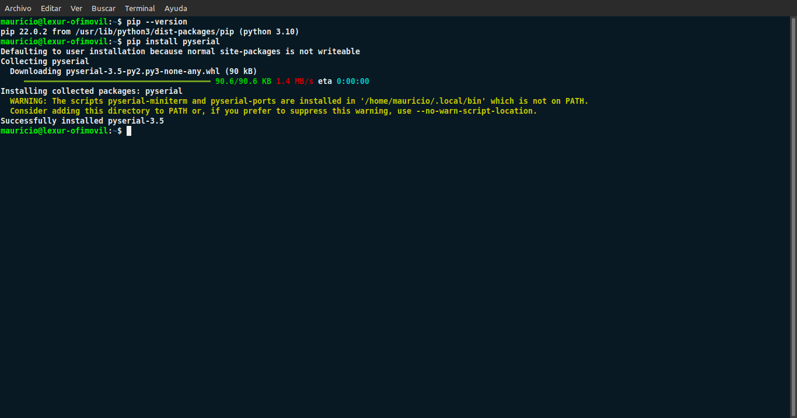
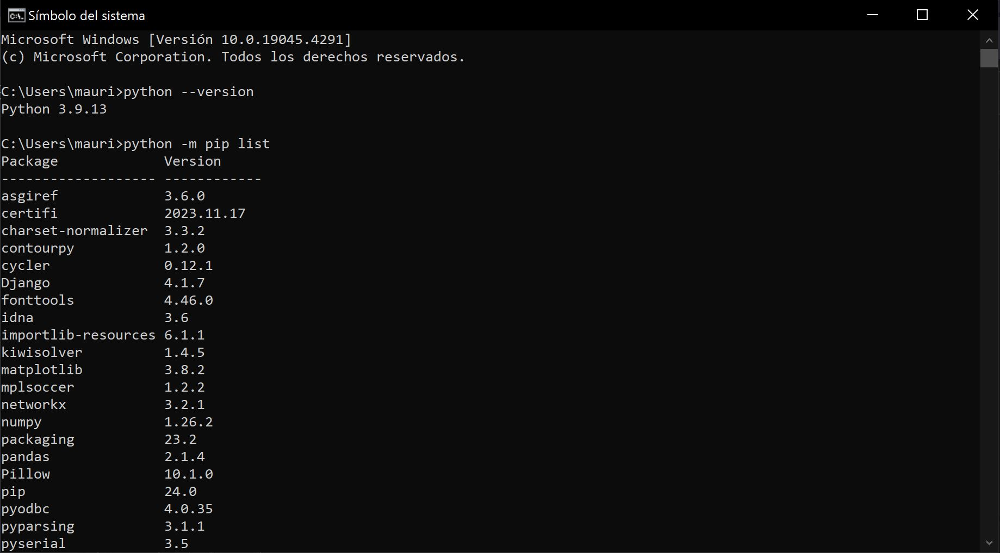
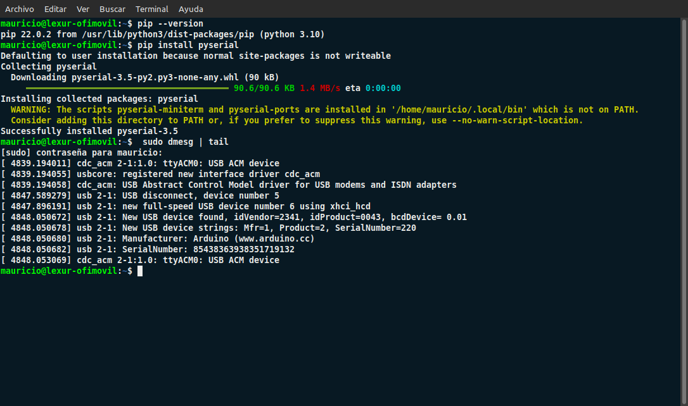
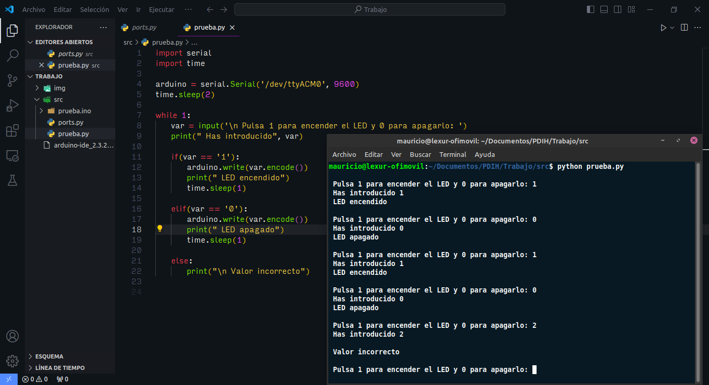
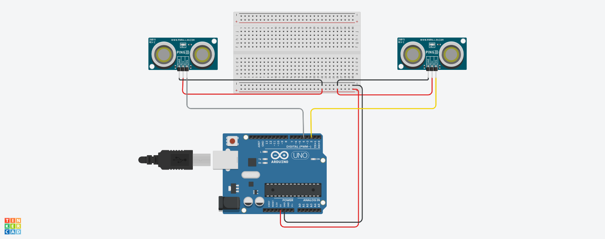
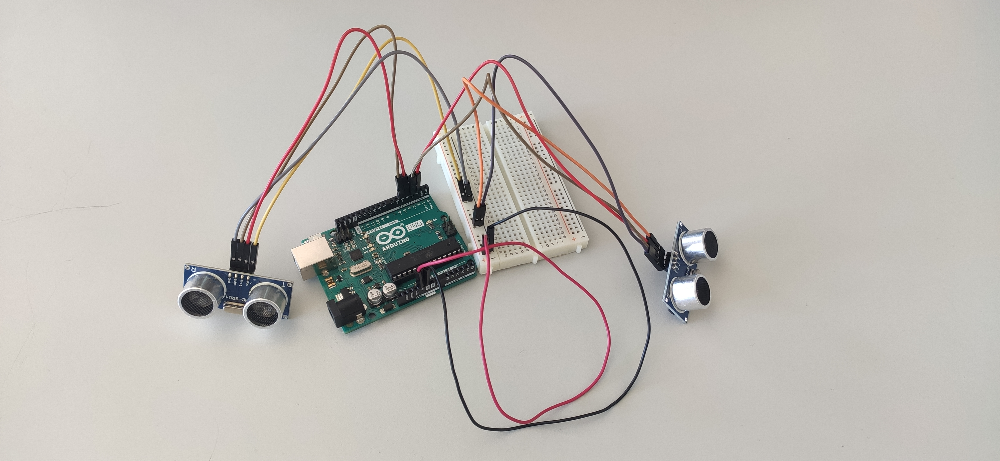
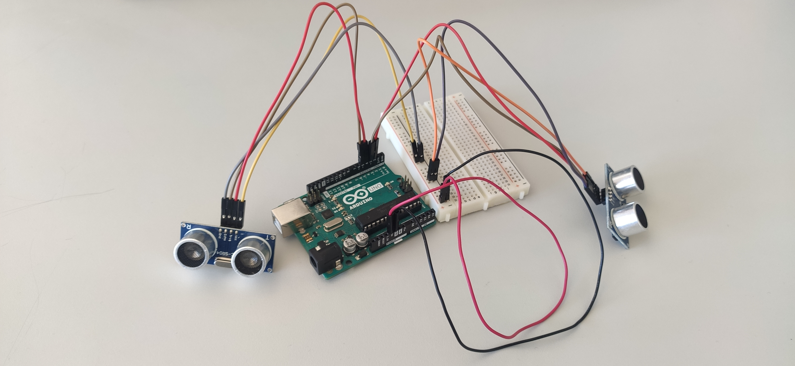

#  Trabajo de la asignatura

## Control de gestos mediante comunicación en serie de Arduino y Python

### Mauricio Luque Jiménez

#### Índice

  - [Motivación](#motivacion)
  - [Comunicación en serie entre el puerto Arduino y código desarrollado en Python](#comunicacion)
    - [Instalación de librería PySerial e identificación de puerto USB](#pyserial)
    - [Primer programa: control de LED mediante entrada de teclado](#teclado)
    - [Segundo programa: introducción a los sensores de ultrasonido](#sensores)
    - [Tercer programa: emisión de mensajes utilizando sensores de ultrasonido y código Python](#python)
  - [Posibles aplicaciones](#aplicaciones)

Este trabajo estudia la comunicación en serie entre una computadora y una placa Arduino y utilizando el programación en lenguaje Python. Para ello, primeramente se mostrará un paso previo para comunicar la entrada de la placa Arduino con el código fuente desarrollado en Python. Después, se mostrarán tres programas que irán evolucionando en cuanto a complejidad, y finalmente se mostrará a modo de sugerencia, una serie de proyectos realizables a partir de lo aquí explicado. Este trabajo se ha desarrollado tanto en Windows como en Linux, por lo que las capturas que se adjuntan pertenecen a ambos sistemas operativos indistintamente.

##  Motivación: ¿por qué este trabajo?

Ante la ausencia de una primera idea decidida para el trabajo, decidí aunar dos cosas que me llaman la atención y despiertan mi curiosidad: por un lado, Arduino, que siempre me ha parecido una herramienta con mucho potencial para desarrollar proyectos a baja escala, y Python, que está a la orden del día en áreas como ciencia de datos o inteligencia artificial. De esta manera, podría ser interesante estudiar dispositivos de interfaz humana combinando estas dos herramientas. Además, como se expone en las [posibles aplicaciones](#aplicaciones) que se exponen al final de esta memoria, puede dar lugar a sistemas realmente prácticos y fáciles de desarrollar por un usuario sin excesivos conocimientos. Además, algunos de los programas que se van a mostrar utilizan otros elementos que se han visto en la asignatura, pero sin demasiada profundidad. Es el caso de los sensores de ultrasonido, que en teoría se han mencionado pero sin una aplicación práctica. Una de las ideas de este trabajo es profundizar en su uso y ponerlos en funcionamiento.

##  Comunicación en serie entre el puerto Arduino y el código fuente Python
###  Instalación de librería PySerial e identificación de puerto USB

Para este trabajo, vamos a hacer un uso ininterrumpido de la librería PySerial, que es la que nos permite comunicarnos con el puerto en serie. El primer paso para establecer la comunicación en serie es instalar la librería e identificar el puerto USB al que está conectado la placa Arduino. En este caso, si queremos instalarla en Linux, asumiendo que Python está ya instalado, lo primero lo hacemos con el comando:

      pip install pyserial

De la misma manera, se puede instalar en Windows:

Por otra parte, hay que identificar el puerto USB. En Linux, esto se hace con el comando:

      sudo dmseg | tail

Así pues, vemos cómo la placa Arduino está conectada al equipo, así como el puerto que tendremos que pasarle al código fuente en Python: el puerto _ttyACM0_. Cabe recalcar que también se podría consultar el puerto en el entorno de desarrollo de Arduino, pero así es una forma más general de obtenerlo. 

En el caso de Windows, tendremos que acceder al Administrador de Dispositivos, concretamente en la sección de _Puertos (COM y LPT)_, donde aparece el dispositivo serie USB en el puerto _COM3_.

[Pulse aquí para volver al inicio de la instalación de PySerial](#pyserial)   
[Pulse aquí para volver al inicio de la comunicación en serie entre Arduino y Python](#comunicacion)   
[Pulse aquí para volver al inicio de la página](#inicio)

###  Primer programa: control de LED mediante entrada de teclado

A partir de ahora, se van a mostrar distintos programas para explorar las funcionalidades de Arduino y Python. A diferencia de lo que se ha hecho hasta ahora, si bien son igual de funcionales en ambos y la única diferencia es el puerto en serie, con el fin de abreviar la demostración, cada programa se probará en un único sistema operativo: los dos primeros se realizarán en Linux, mientras que el tercero se mostrará en Windows.

El [primer programa](https://circuitdigest.com/microcontroller-projects/arduino-python-tutorial) va a consistir en controlad un LED mediante entrada de teclado: el LED se encenderá pulsando 1, mientras que se apagará pulsando 0.

Una vez pasamos al código fuente, lo primero que hay que hacer es indicarle a una variable _arduino_ el puerto de entrada (al ser Linux el puerto es _ttyACM0_, en Windows ya hemos visto que sería el puerto _COM3_) mediante la librería _serial_ previamente importada. El resto del programa es sencillo, puesto que es seguir el funcionamiento anteriormente explicado. De esta manera, tenemos dos archivos de código fuente: el código en Python que interactúa con la salida por pantalla mediante la cual se indicará si el LED se enciende o apaga (o si el valor introducido mediante teclado es incorrecto), y el código en Arduino que activa el LED conectado a la placa.

Así pues, ésta es la salida por pantalla:

Y así es el funcionamiento del LED:

https://github.com/mauricioluquejimenez/PDIH/assets/72136756/dc2134e7-8bb5-4681-82e4-fca6f8c7cdcd

[Pulse aquí para volver al inicio del primer programa](#teclado)    
[Pulse aquí para volver al inicio de la comunicación en serie entre Arduino y Python](#comunicacion)   
[Pulse aquí para volver al inicio de la página](#inicio)

###  Segundo programa: introducción a los sensores de ultrasonido

Una vez hemos establecido la conexión entre Arduino y el código fuente, vamos a añadir una capa más de complejidad añadiendo un nuevo componente: los sensores de ultrasonido, cuyo funcionamiento se explicará más adelante.

Lo primero que vamos a hacer es la construcción del circuito físico en la placa de Arduino. En este caso, vamos a necesitar dos sensores de ultrasonidos que capten los gestos, que van a estar comunicados mediante una placa de prototipado.

De esta manera, el circuito, primeramente diseñado en TinkerCad, se ve así:

Cabe destacar que el sensor de ultrasonido disponible en TinkerCad no es idéntico al utilizado realmente en el trabajo, puesto que sólo hay tres patillas disponibles en lugar de cuatro (concretamente, en lugar de las entradas _trig_ y _echo_ únicamente disponenmos de la entrada _sig_). Así pues, se ha simulado que esa tercera patilla corresponde con la conexión con la placa Arduino, aunque, como se va a ver posteriormente, realmente hay dos conexiones.

De esta manera, el circuito real se ve así:

Para probar su funcionamiento, vamos a hacer varios programas dentro de uno: primero se va a probar el funcionamiento de un único sensor, para posteriormente probar los dos a la vez. Los sensores van a ser utilizados para encender un LED, en vez de hacerlo por teclado como en el primer programa. Para ello, es importante entender el funcionamiento del sensor. Como se ha explicado en clase de teoría, el sensor puede medir la distancia de un objeto cercano para hacer determinadas acciones indicadas previamente. Esta medición se hace mediante la emisión y recepción de una onda sonora (proceso que en Arduino se realiza llamando a la función _pulseIn()_) y de su consecuente perturbación. Así pues, para calcular la distancia a la que se encuentra un objeto, sabiendo que:

    velocidad = distancia / tiempo

Podemos despejar la distancia, de manera que:

    distancia = tiempo X velocidad

De esta manera, la distancia del objeto es igual al tiempo que tarde la onda en emitirse y recibirse (10 microsegundos) multiplicado por la velocidad (en este caso la velocidad del sonido, aproximadamente 340 metros por segundo). Por tanto, en todos los programas que utilicen los sensores, van a estar presentes los siguientes elementos:

- Una función _calculate_distance()_ a la que se le van a pasar como argumento los pins del sensor que se quiere utilizar como medidor
- Una constante _sonido_ que va a representar la velocidad de la onda sonora
- Dos variables, _distancia_ y _tiempo_, que van a representar la distancia a la que se encuentra el objeto y el tiempo que tarda en realizar la comprobación el sensor.

Adicionalmente, como para la medición la onda hace un viaje de ida y vuelta (emisión y recepción), hay que dividir el tiempo por la mitad para sólo contar el viaje de ida. Además, como el tiempo de emisión se mide en microsegundos, y hemos dicho que la velocidad del sonido es 340 metros por segundo, hay que convertir las unidades a centímetros (la medida más práctica para las distancias que se van a manejar) por microsegundo. Esto, utilizando factores de conversión, se ve así:

$$ 340 {metros \over segundo} . {10^2 centímetros \over 1 metro} . {1 segundo \over 10^6 microsegundos}$$ 

Para simplificar el cálculo, directamente se divide por 10.000. Finalmente, así se ve la función completa en Arduino:

    void calculate_distance(int trigger, int echo)
    {
      digitalWrite(trigger, HIGH);
      delayMicroseconds(10);
      digitalWrite(trigger, LOW);

      tiempo = pulseIn(echo, HIGH);
      distancia = (tiempo * sonido) / (2 * 10000);
    }

Ahora que ya podemos medir la distancia a nuestro sensor, vamos a hacer una serie de programas sencillos que simplemente enciendan un LED en función de la distancia a la que pongamos la mano. Si está a una distancia superior (el caso general), el LED no se encenderá, pero si se acerca a una distancia suficiente para obligar a que la perturbación de la onda sonora sea intencial, el LED se encenderá.

Primeramente, vamos a hacer la prueba con un único sensor y un único LED. El circuito en TinkerCad propuesto es el siguiente:

Y así es su funcionamiento:

https://github.com/mauricioluquejimenez/PDIH/assets/72136756/c24f96d5-e475-49a1-94da-2ab41342369e

En este vídeo, se ha mostrado un único LED que se encide y se apaga, pero también se pueden hacer funcionar dos LED con el mismo sensor. En el siguiente vídeo se muestra cómo, si el sensor no detecta nada a una distancia menor que la indicada, enciende el LED amarillo, mientras que si nota una presencia cercana, lo apaga y enciende el LED rojo, previamente apagado.

https://github.com/mauricioluquejimenez/PDIH/assets/72136756/b68bcb35-2110-4e14-b005-0127ca4a3272

Después de este primer paso, vamos a conectar un segundo sensor para manejar cada LED con un sensor propio. Al igual que anteriormente, éste es el diseño del circuito en TinkerCad (aparte de añadir dos LED con sus respectivas resistencias, como en el caso anterior):

Y éste es su funcionamiento:

https://github.com/mauricioluquejimenez/PDIH/assets/72136756/1a0eb3ac-c55e-4ecf-9441-3ecf98be6ab0

[Pulse aquí para volver al inicio del segundo programa](#sensores)   
[Pulse aquí para volver al inicio de la comunicación en serie entre Arduino y Python](#comunicacion)  
[Pulse aquí para volver al inicio de la página](#inicio)

###  Tercer programa: emisión de mensajes utilizando sensores de ultrasonido y código Python

Ya hemos visto la comunicación entre Arduino y Python y el funcionamiento coordinado mediante entradas de teclado, y posteriormente hemos visto el manejo de sensores ultrasonido utilizando únicamente código Arduino. Por último, el tercer programa mezcla ambos factores: utilizar los sensores de Arduino para conectar la placa con código fuente desarrollado en Python. Para ello, hay que introducir unas funciones de Arduino y Python que traspasan lo que en este caso van a ser breves cadenas de texto, aunque se podría pasar cualquier dato. Concretamente, se trata de las funciones _Serial.println()_ en Arduino, que es la que envía los datos a través del puerto en serie, y la función _arduino.readline()_ en Python, que es la que recibe la línea enviada, siendo _arduino_ la variable en la que hemos indicado el puerto, como se ha explicado al principio de la memoria.

Para este programa sólo se va a utilizar un sensor simultáneo, aunque, como se ha visto en el segundo programa, se podrían utilizar más de uno. De esta manera, y orientado a la referencia original de este trabajo, se va a mandar un mensaje al código Python en función de la distancia a la que se encuentre nuestra mano del sensor. Para controlar mejor este proceso, se van a mantener los LED utilizados en el segundo programa, aunque evidentemente no son necesarios. Primeramente, si no se acerca la mano, aparecerá "reproducir", y si se acerca se emitirá la cadena "pausa", como si se quisiera detener la reproducción de un vídeo acercando la mano (lo normal es no hacer ningún gesto, alejar la mano y reproducir el vídeo).

Así pues, este primer bloque funciona así:

https://github.com/mauricioluquejimenez/PDIH/assets/72136756/4887c4c9-dd81-4a69-bdcd-b91cfe966790

En segundo lugar, se va a alternar entre las cadenas "up" y "down" (como si se quisiera subir y bajar el volumen del vídeo, por ejemplo). El funcionamiento de este segundo bloque es el siguiente:

https://github.com/mauricioluquejimenez/PDIH/assets/72136756/8cd25139-8b30-4088-8758-d96f130169ad

De esta manera, ya hemos conseguido una comunicación plena entre una placa de Arduino y un programa escrito en lenguaje Python, utilizando sensores de ultrasonido que permiten controlar el funcionamiento del programa mediante simples gestos.

[Pulse aquí para volver al inicio del tercer programa](#python)   
[Pulse aquí para volver al inicio de la comunicación en serie entre Arduino y Python](#comunicacion)  
[Pulse aquí para volver al inicio de la página](#inicio)

##  Posibles aplicaciones

Cuantas se quieran. En este trabajo se ha hecho una pequeña demostración, pero las posibilidades son cuantiosas. Sin ir más lejos, el siguiente paso podría ser utilizar más de un sensor para controlar diversos aspectos simultáneamente, o añadir condiciones al código en Arduino para tener diferentes escalas de distancia, en vez de dos. Mismamente, el proyecto en el que se basa este trabajo es capaz de controlar un reproductor de vídeo mediante una librería que simula las pulsaciones del teclado, pudiendo ejecutar comandos. También se podría diseñar un pequeño semáforo, una vez se tienen los sensores y la capacidad de iluminar varios LED. Por otra parte, este trabajo se ha realizado con unos conocimientos básicos de Python, pero la existencia de librerías como _numpy_ o _pandas_ permite almacenar datos captados mediante sensores con una base de datos con un uso más específico o provechoso. Las posibilidades son tantas como el tiempo y el esfuerzo que se le quiera dedicar.

_Porque si puedes imaginarlo, puedes programarlo._

## Bibliografía y referencias

- [Referencia del proyecto en la web de Arduino](https://blog.arduino.cc/2017/11/06/simple-computer-gesture-control-with-arduino-and-python/)
- [Referencia del proyecto en la web de CircuitDigest](https://circuitdigest.com/microcontroller-projects/control-your-computer-with-hand-gestures)
- [Primer programa con Arduino y Python: control de LED](https://circuitdigest.com/microcontroller-projects/arduino-python-tutorial)
- [Comunicación en serie con Arduino usando Python en Linux](https://www.instructables.com/Linux-Serial-Port-Communication-With-Arduino-Using/)
- [Comunicación en serie con Arduino usando Python en Windows](https://www.xanthium.in/Cross-Platform-serial-communication-using-Python-and-PySerial)
- [Primeros programas de comunicación en serie con Arduino usando Python](https://github.com/xanthium-enterprises/CrossPlatform-Serial-Port-Programming-using-Python-and-PySerial)
- [Uso del sensor de ultrasonido con Arduino](https://circuitdigest.com/microcontroller-projects/arduino-ultrasonic-sensor-based-distance-measurement)
